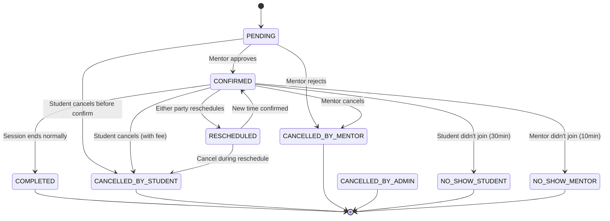

# Mentoring Calendar & Scheduling Module — Full Design

> **Scope:** Mentor-Mentee marketplace platform calendar/scheduling system
> **Design Philosophy:** Feature-complete for marketplace primitives, no unnecessary Google Calendar cloning

---

## Table of Contents

1. [Data Model](#1-data-model)
2. [Feature Inventory](#2-feature-inventory)
3. [Booking Lifecycle & State Machine](#3-booking-lifecycle)
4. [Conflict Detection & Atomicity](#4-conflict-detection)
5. [APIs / Backend Architecture](#5-api-architecture)
6. [Frontend Views & Components](#6-frontend-views)
7. [Notifications & Reminders](#7-notifications)
8. [Calendar Export & External Sync](#8-calendar-export)
9. [Waitlist System](#9-waitlist-system)
10. [Cancellation & Rescheduling Policy](#10-policies)
11. [Admin & Dispute Resolution](#11-admin)
12. [Implementation Phasing](#12-phasing)

---

## 1. Data Model

### 1.1 Prisma Schema

```prisma
// ──────── Profile ────────

model MentorProfile {
  id              String   @id @default(uuid())
  userId          String   @unique
  user            User     @relation(fields: [userId], references: [id], onDelete: Cascade)

  // Profile
  headline        String?             // "Senior Full-Stack Engineer @ Google"
  bio             String?
  expertiseAreas  String[]            // ["React", "System Design", "Career Coaching"]
  hourlyRate      Decimal  @default(0) // INR, per-session rate
  durationMinutes Int      @default(60) // Default session length
  isAvailable     Boolean  @default(true)

  // Relationships
  availabilitySlots MentorAvailabilitySlot[]
  bookings          MentorBooking[]          @relation("MentorBookingMentor")
  reviews           MentorReview[]
  waitlistEntries   MentorWaitlistEntry[]

  createdAt DateTime @default(now())
  updatedAt DateTime @updatedAt
}

// ──────── Availability ────────

model MentorAvailabilitySlot {
  id              String   @id @default(uuid())
  mentorProfileId String
  mentorProfile   MentorProfile @relation(fields: [mentorProfileId], references: [id], onDelete: Cascade)

  // Recurring basis (e.g., "Every Monday")
  dayOfWeek   Int?     // 0=Sun … 6=Sat (null = date-specific)
  startTime   DateTime // TIME component only (e.g., 2000-01-01T14:00:00Z)
  endTime     DateTime

  // Date-specific (e.g., "Dec 25 off" or "extra slot on Jan 10")
  specificDate DateTime?

  // Control
  isRecurring Boolean @default(true)
  isBooked    Boolean @default(false) // Entire slot blocked (not just individual bookings)
  maxBookings Int     @default(1)     // How many students per slot (group sessions)
  bufferAfter Int     @default(0)     // Minutes of buffer after this slot (prep time)

  // Status
  isActive    Boolean @default(true)

  createdAt   DateTime @default(now())
  updatedAt   DateTime @updatedAt
}

// ──────── Booking ────────

enum BookingStatus {
  PENDING         // Waiting for mentor confirmation (request-based)
  CONFIRMED       // Approved & scheduled
  RESCHEDULED     // Has been rescheduled (for audit trace)
  COMPLETED       // Session done
  CANCELLED_BY_STUDENT
  CANCELLED_BY_MENTOR
  CANCELLED_BY_ADMIN
  NO_SHOW_STUDENT
  NO_SHOW_MENTOR
}

model MentorBooking {
  id              String   @id @default(uuid())
  mentorProfileId String
  mentorProfile   MentorProfile @relation("MentorBookingMentor", fields: [mentorProfileId], references: [id], onDelete: Restrict)
  studentUserId   String
  student         User     @relation("MentorBookingStudent", fields: [studentUserId], references: [id], onDelete: Restrict)

  // Slot information
  startTime       DateTime
  endTime         DateTime
  durationMinutes Int

  // Status
  status          BookingStatus @default(PENDING)
  statusChangedAt DateTime?
  cancellationReason String?
  rescheduleCount Int      @default(0)

  // Payment
  amount          Decimal  // Fee charged to student
  mentorPayout    Decimal  // Amount credited to mentor
  walletTxId      String?  // Razorpay wallet transaction ID
  refundTxId      String?  // If cancelled, refund transaction

  // Jitsi
  jitsiRoomName   String?  // Auto-generated, e.g., "mentor-booking-<uuid>"
  jitsiRoomUrl    String?  // Full URL
  jitsiJwtToken   String?  // JWT for room auth

  // Review
  mentorReview      MentorReview?
  studentFeedback   String?  // Post-session feedback from student (non-review)
  mentorPrivateNotes String? // Private notes only mentor sees

  // Audit
  previousStatus  BookingStatus? // For status transition tracking
  rescheduledFrom DateTime?      // Original time (for audit)
  rescheduledTo   DateTime?      // New time

  createdAt DateTime @default(now())
  updatedAt DateTime @updatedAt

  @@index([mentorProfileId, startTime])
  @@index([studentUserId])
  @@index([status])
}

// ──────── Audit Log ────────

model MentorBookingAudit {
  id          String   @id @default(uuid())
  bookingId   String
  booking     MentorBooking @relation(fields: [bookingId], references: [id], onDelete: Cascade)
  fromStatus  BookingStatus?
  toStatus    BookingStatus
  changedBy   String   // "student", "mentor", "system", "admin"
  changedById String?  // userId
  reason      String?
  metadata    Json?    // Additional context (old time, new time, refund amount, etc.)

  createdAt   DateTime @default(now())
}

// ──────── Review ────────

model MentorReview {
  id              String   @id @default(uuid())
  mentorProfileId String
  mentorProfile   MentorProfile @relation(fields: [mentorProfileId], references: [id], onDelete: Cascade)
  reviewerId      String
  reviewer        User     @relation("MentorReviewer", fields: [reviewerId], references: [id], onDelete: Cascade)
  bookingId       String   @unique
  booking         MentorBooking @relation(fields: [bookingId], references: [id], onDelete: Restrict)

  // Rating
  rating          Int      // 1-5
  reviewText      String?
  criteria        Json?    // { "communication": 5, "expertise": 4, "preparation": 5 }

  createdAt       DateTime @default(now())
  updatedAt       DateTime @updatedAt
}

// ──────── Waitlist ────────

model MentorWaitlistEntry {
  id              String   @id @default(uuid())
  mentorProfileId String
  mentorProfile   MentorProfile @relation(fields: [mentorProfileId], references: [id], onDelete: Cascade)
  studentUserId   String
  student         User     @relation(fields: [studentUserId], references: [id], onDelete: Cascade)

  // What they're waiting for
  desiredDuration Int      // Minutes
  preferredDays   Int[]?   // Day-of-week preferences
  notifyByEmail   Boolean  @default(true)
  expiresAt       DateTime // Auto-expire after 30 days

  // Status
  isActive        Boolean  @default(true)
  notifiedAt      DateTime? // When we last notified them
  convertedAt     DateTime? // When they actually booked
  convertedBookingId String? // Which booking they created

  createdAt       DateTime @default(now())
  updatedAt       DateTime @updatedAt

  @@unique([mentorProfileId, studentUserId, isActive])
}

// ──────── Mentor Task ────────

enum MentorTaskPriority {
  LOW, MEDIUM, HIGH
}

model MentorTask {
  id              String   @id @default(uuid())
  mentorProfileId String
  mentorProfile   MentorProfile @relation(fields: [mentorProfileId], references: [id], onDelete: Cascade)
  relatedBookingId String? // Optional link to a specific booking

  // Content
  title           String
  description     String?
  priority        MentorTaskPriority @default(MEDIUM)
  isCompleted     Boolean  @default(false)
  dueDate         DateTime?

  // For pre-session preparation tasks
  taskType        String   @default("general") // "general", "pre_session", "post_session", "follow_up"

  createdAt       DateTime @default(now())
  updatedAt       DateTime @updatedAt
}
```

### 1.2 Key Design Decisions

| Decision | Rationale |
|----------|-----------|
| **Availability = slots on calendar** (not blocks with "slots within") | Simpler data model for 1:1 mentoring. A slot IS an available time window. No nested "booking within availability" queries. |
| **BookingStatus as enum** | Clear state machine. Each status transition is audited. |
| **No cascading deletes** on bookings | You never want to accidentally cascade-delete a booking history. `Restrict` forces explicit handling. |
| **Separate audit table** | Changes to bookings (status, time) need immutable audit trail for disputes, payouts. |
| **MentorProfile as separate model** | Not all users are mentors. Separation keeps the `User` model clean and allows mentors to have full profile data. |

---

## 2. Feature Inventory

### 2.1 Mentor Features

| Feature | Details |
|---------|---------|
| **Set weekly recurring availability** | Pick days + time ranges (e.g., Mon 2-5PM, Wed 10-12PM, Fri 2-4PM) |
| **Set date-specific slots** | Override recurring for a particular date (e.g., add extra slot, block a date) |
| **Block time off** | One-off date range blocks (vacation, holidays, personal) |
| **Set session duration** | Per-profile default (30/60/90 min), adjustable per availability slot |
| **Buffer time** | Gap between sessions for prep/notes (e.g., 15min default) |
| **Max sessions per day** | Limit to prevent burnout |
| **Approval mode** | Choose: "Auto-confirm" (instant) or "Manual review" (request-based) |
| **Session notes** | Private notes for each booking (student details, discussion topics) |
| **Pre/post session tasks** | Create to-dos linked to specific bookings |
| **Calendar view** | See my upcoming sessions, past sessions, cancelled |
| **Earnings dashboard** | Total earned, pending payouts, per-session breakdown |
| **Booking dashboard** | Manage all bookings: confirm, cancel, reschedule, mark no-show |
| **Availability template** | Save common schedules as templates for re-use |

### 2.2 Student Features

| Feature | Details |
|---------|---------|
| **Browse mentors** | List/search/filter by expertise, rating, rate, availability |
| **View mentor profile** | Headline, bio, reviews, ratings, availability |
| **View mentor schedule** | Calendar view of available slots |
| **Book immediately** | Pick a slot that's open now — instant book (auto-confirm) |
| **Request booking** | Send a request if mentor requires approval |
| **Book recurring** | "Book this same slot every week for 4 weeks" |
| **Reschedule** | Change time before cutoff (per policy) |
| **Cancel** | With fee schedule per policy |
| **Session goals** | Add notes/goals to the booking before session |
| **Join video** | One-click from booking page |
| **Leave review** | After session completed |
| **Upcoming/done** | Dashboard with all bookings |
| **Waitlist** | Join waitlist for popular mentors → notified when slot opens |

### 2.3 Platform/Cross-Cutting

| Feature | Details |
|---------|---------|
| **Conflict detection** | No double-booking. Atomic Prisma transaction prevents race conditions. |
| **.ics export** | Download or auto-send via email for import into Google/Outlook/Apple Calendar |
| **Reminders** | E-mail + in-app: 24h, 1h, 15min before session |
| **Status change alerts** | Email on: confirmed, rescheduled, cancelled, completed |
| **Audit trail** | Every status change logged with who, when, why |
| **Wallet integration** | Payment at booking → held in escrow → released after session |
| **Admin dashboard** | Platform-wide view of all mentoring activity |
| **Dispute management** | Escalate issues, force resolution, manage refunds |

---

## 3. Booking Lifecycle & State Machine



### 3.1 Status Transition Rules

| Transition | Who Can | Conditions | Wallet Action |
|------------|---------|------------|---------------|
| PENDING → CONFIRMED | Mentor | Within booking window (min 24h before start) | Hold amount |
| CONFIRMED → COMPLETED | System | Auto-detected (session end time + grace) | Release to mentor |
| CONFIRMED → CANCELLED_BY_STUDENT | Student | Before deadline | Refund (per policy) |
| CONFIRMED → CANCELLED_BY_MENTOR | Mentor | Any time | Full refund + penalty |
| CONFIRMED → RESCHEDULED | Both | Before deadline | Hold carries over |
| CONFIRMED → NO_SHOW_STUDENT | System | No join 20min past start time | Forfeit (mentor paid) |
| CONFIRMED → NO_SHOW_MENTOR | System | Mentor didn't join 10min past | Full refund + penalty to mentor |

---

## 4. Conflict Detection & Atomicity

### 4.1 Booking Conflict Check

When a student books a slot, run this in a **Prisma transaction**:

```typescript
async function createBooking(dto: CreateBookingDto) {
  return prisma.$transaction(async (tx) => {
    // 1. Check mentor availability slot exists and is active
    const slot = await tx.mentorAvailabilitySlot.findFirst({
      where: {
        id: dto.slotId,
        mentorProfileId: dto.mentorProfileId,
        isActive: true,
        isBooked: false,
      },
    });

    if (!slot) throw new NotFoundException('Slot not available');

    // 2. Check there's no confirmed booking overlapping (time-based conflict)
    const conflictingBooking = await tx.mentorBooking.findFirst({
      where: {
        mentorProfileId: dto.mentorProfileId,
        status: { in: [BookingStatus.CONFIRMED, BookingStatus.PENDING] },
        // Overlap condition: existing.start < new.end AND existing.end > new.start
        AND: [
          { startTime: { lt: new Date(dto.endTime) } },
          { endTime: { gt: new Date(dto.startTime) } },
        ],
      },
    });

    if (conflictingBooking) {
      throw new ConflictException('Slot already booked');
    }

    // 3. Create booking
    // 4. Deduct wallet
    // 5. Generate Jitsi room
    // 6. Send notification
    // 7. Return booking
  });
}
```

### 4.2 Race Condition Protection

- **Database-level**: The conflict query runs inside a `$transaction` with serializable isolation — PostgreSQL prevents two simultaneous transactions from both passing the conflict check.
- **Application-level**: Retry wrapper for the rare serialization failure (PostgreSQL `40001` error).

---

## 5. Backend API Architecture

### 5.1 Module Structure (NestJS)

```
src/modules/mentoring/
├── mentoring.module.ts
│
├── profiles/
│   ├── mentor-profile.controller.ts
│   ├── mentor-profile.service.ts
│   ├── dto/
│   │   ├── create-mentor-profile.dto.ts
│   │   ├── update-mentor-profile.dto.ts
│   │   └── mentor-profile-response.dto.ts
│   └── mentor-profile.service.spec.ts
│
├── availability/
│   ├── mentor-availability.controller.ts
│   ├── mentor-availability.service.ts
│   ├── dto/
│   │   ├── create-slot.dto.ts
│   │   ├── update-slot.dto.ts
│   │   └── slot-response.dto.ts
│   └── mentor-availability.service.spec.ts
│
├── booking/
│   ├── mentor-booking.controller.ts
│   ├── mentor-booking.service.ts
│   ├── dto/
│   │   ├── create-booking.dto.ts
│   │   ├── cancel-booking.dto.ts
│   │   ├── reschedule-booking.dto.ts
│   │   └── booking-response.dto.ts
│   └── mentor-booking.service.spec.ts
│
├── reviews/
│   ├── mentor-review.controller.ts
│   ├── mentor-review.service.ts
│   └── dto/
│       ├── create-review.dto.ts
│       └── review-response.dto.ts
│
├── waitlist/
│   ├── mentor-waitlist.controller.ts
│   ├── mentor-waitlist.service.ts
│   └── dto/
│       └── waitlist.dto.ts
│
├── tasks/
│   ├── mentor-task.controller.ts
│   ├── mentor-task.service.ts
│   └── dto/
│       ├── create-task.dto.ts
│       └── update-task.dto.ts
│
├── calendar/
│   ├── calendar.controller.ts        # For .ics export + calendar views
│   ├── calendar.service.ts
│   └── dto/
│       └── calendar-query.dto.ts
│
├── admin/
│   ├── mentor-admin.controller.ts
│   ├── mentor-admin.service.ts
│   └── dto/
│       └── admin-actions.dto.ts
│
└── common/
    ├── mentor-policies.service.ts      # Cancellation, reschedule policies
    ├── mentor-notifications.service.ts # Email/in-app notifications
    ├── mentor-payment.service.ts       # Wallet integration
    └── jitsi-room.service.ts           # Room + JWT generation
```

### 5.2 Key API Endpoints

#### Mentor Profile

| Method | Path | Purpose |
|--------|------|---------|
| `POST` | `/mentor/profiles` | Create mentor profile |
| `GET` | `/mentor/profiles/:id` | Get mentor profile |
| `PATCH` | `/mentor/profiles/:id` | Update profile |
| `GET` | `/mentor/profiles` | List/search mentors (`?expertise=react&minRating=4&available=true`) |
| `GET` | `/mentor/profiles/:id/schedule` | Get available slots for a date range |

#### Availability

| Method | Path | Purpose |
|--------|------|---------|
| `POST` | `/mentor/availability` | Create recurring slot(s) |
| `POST` | `/mentor/availability/date` | Create date-specific slot |
| `GET` | `/mentor/availability` | Get my slots (mentor dashboard) |
| `DELETE` | `/mentor/availability/:id` | Remove a slot |
| `PATCH` | `/mentor/availability/:id` | Update slot (isActive, maxBookings) |
| `POST` | `/mentor/availability/bulk` | Bulk create from template |

#### Booking

| Method | Path | Purpose |
|--------|------|---------|
| `POST` | `/mentor/bookings` | Create booking (student) |
| `GET` | `/mentor/bookings` | List bookings (my bookings) |
| `GET` | `/mentor/bookings/:id` | Get booking detail |
| `POST` | `/mentor/bookings/:id/cancel` | Cancel booking |
| `POST` | `/mentor/bookings/:id/reschedule` | Reschedule booking |
| `POST` | `/mentor/bookings/:id/confirm` | Confirm (mentor approves PENDING) |
| `POST` | `/mentor/bookings/:id/mark-no-show` | Mark no-show (mentor/admin) |
| `GET` | `/mentor/bookings/:id/join` | Generate Jitsi link + JWT |

#### Reviews

| Method | Path | Purpose |
|--------|------|---------|
| `POST` | `/mentor/reviews` | Create review (student, after COMPLETED) |
| `GET` | `/mentor/reviews/:mentorProfileId` | List reviews for a mentor |

#### Waitlist

| Method | Path | Purpose |
|--------|------|---------|
| `POST` | `/mentor/waitlist` | Join waitlist (student) |
| `DELETE` | `/mentor/waitlist` | Leave waitlist |
| `GET` | `/mentor/waitlist` | My waitlist entries |

#### Tasks

| Method | Path | Purpose |
|--------|------|---------|
| `POST` | `/mentor/tasks` | Create task |
| `GET` | `/mentor/tasks` | List tasks |
| `PATCH` | `/mentor/tasks/:id` | Update task status/detail |
| `DELETE` | `/mentor/tasks/:id` | Delete task |

#### Calendar Export

| Method | Path | Purpose |
|--------|------|---------|
| `GET` | `/mentor/calendar/export` | `.ics` file for own bookings |
| `GET` | `/mentor/calendar/slots` | Calendar data for frontend rendering (monthly) |

#### Admin

| Method | Path | Purpose |
|--------|------|---------|
| `GET` | `/admin/mentor/overview` | Platform stats (active bookings, disputes) |
| `POST` | `/admin/mentor/bookings/:id/cancel` | Force cancel booking |
| `GET` | `/admin/mentor/bookings/:id/audit` | Full audit log |

---

## 6. Frontend Views & Components

### 6.1 Page Structure (Next.js)

```
app/(app)/
├── mentor/
│   ├── dashboard/           ← Mentor's main calendar + booking management
│   │   ├── page.tsx
│   │   ├── components/
│   │   │   ├── mentor-calendar.tsx        (month/week/day toggle)
│   │   │   ├── slot-creator.tsx           (set recurring/date-specific slots)
│   │   │   ├── booking-list.tsx           (upcoming, pending, past tabs)
│   │   │   ├── booking-card.tsx           (individual booking actions)
│   │   │   ├── task-panel.tsx             (to-dos sidebar)
│   │   │   ├── earnings-summary.tsx       (quick stats)
│   │   │   └── availability-panel.tsx     (manage recurring schedule)
│   │   └── styles/
│   │
│   ├── profile/             ← Mentor public profile (editable)
│   ├── bookings/[id]/       ← Single booking detail + join video
│   └── settings/            ← Availability defaults, approval mode
│
├── find-mentors/            ← Student: browse + filter mentors
│   ├── page.tsx
│   ├── components/
│   │   ├── mentor-card.tsx            (search result card)
│   │   ├── mentor-list.tsx            (filtered results)
│   │   └── search-filters.tsx         (expertise, rating, rate, availability)
│   └── [id]/               ← Mentor profile + available slots
│       ├── page.tsx
│       ├── components/
│       │   ├── mentor-header.tsx       (photo, bio, stats)
│       │   ├── mentor-schedule.tsx      (calendar with open slots)
│       │   ├── slot-picker.tsx          (click to select a time)
│       │   ├── booking-confirmation.tsx (review + confirm modal)
│       │   └── reviews-section.tsx     (ratings display)
│       └── sidebar/
│           └── booking-summary.tsx      (duration, cost, confirm)
│
├── my-bookings/             ← Student: all bookings
│   ├── page.tsx
│   └── components/
│       ├── booking-list.tsx
│       ├── upcoming-card.tsx
│       └── past-card.tsx
│
└── admin/mentoring/         ← Admin dashboard
    ├── page.tsx
    └── components/
        ├── metrics-cards.tsx
        ├── bookings-table.tsx
        └── dispute-panel.tsx
```

### 6.2 Key UI Components (Design Notes)

#### Mentor Calendar (Week/Month View)
- **Purpose**: Let mentor see their schedule at a glance + manage availability
- **Features**: Month/week/day toggle, existing bookings shown as blocks, empty = available, drag to create slots
- **State**: Shows availability slots (green), confirmed bookings (blue), cancelled (red with strikethrough), past (grey)

#### Slot Picker (Student Booking)
- **Purpose**: Let student see available times and pick one
- **Features**: Shows mentor's available slots for next 7/14/30 days, click to select, preview duration + cost, confirm button
- **State**: Available (green outline), selected (filled blue), unavailable/greyed (past times, fully booked)

#### Booking Card (Both Roles)
- **Purpose**: Compact booking representation in list/feed
- **Features**: Mentor name/photo, date/time, duration, status badge, action buttons (join, cancel, reschedule, review)
- **States**: One card per booking across all lifecycle phases

#### Confirm/Reschedule/Cancel Modals
- **Cancel**: Show policy (fee if any), confirmation checkbox, reason field
- **Reschedule**: Show slot picker (same mentor), show current booking info for reference
- **Confirm**: Summary of booking, wallet balance, confirm button

### 6.3 Calendar Library Choice

**Recommendation: Use a library, don't build from scratch**

| Library | Why |
|---------|-----|
| **react-big-calendar** | Mature, straightforward for month/week/day views. Handles slot rendering + event blocks. Fits exactly our use case. |
| **Day.js** (already in stack) | For all date/time manipulation, timezone handling, formatting |
| Custom availability grid | For the "slot picker" — simpler than a full calendar, just show available time blocks per day |

No need for FullCalendar (heavy) or building a Google Calendar clone. `react-big-calendar` + custom slot picker grid = all you need.

---

## 7. Notifications & Reminders

### 7.1 When to Notify

| Event | Trigger | Channel | Priority |
|-------|---------|---------|----------|
| Booking confirmed | Student books (auto-confirm) OR mentor confirms | Email + in-app | High |
| Booking PENDING (request-based) | Student creates booking awaiting approval | Email (to mentor) | High |
| Mentor takes action | Reviews/confirms/cancels | Email + in-app | High |
| 24h before session | Cron checks upcoming bookings | Email | Medium |
| 1h before session | Cron check | Email + in-app | High |
| 15min before session | Cron check | In-app toast/banner | High |
| Session ready to join | Booking status = CONFIRMED + current time in range | Email + in-app | High |
| Session ended | System auto-detect (end time + 5min) | Email | Low |
| Review prompt | 1h after session ended | Email + in-app | Low |
| Slot becomes available | Waitlist triggered (mentor opens a slot) | Email | High |
| Booking rescheduled | Both parties | Email + in-app | High |
| Booking cancelled | Any party | Email + in-app | High |
| No-show penalty | Auto-detect | Email | High |
| Upcoming week summary | Every Sunday 8AM | Email | Low |

### 7.2 Implementation

```typescript
// NestJS @nestjs/schedule
@Cron(CronExpression.EVERY_30_MINUTES)
async sendBookingReminders() {
  const upcoming = await this.prisma.mentorBooking.findMany({
    where: {
      status: BookingStatus.CONFIRMED,
      startTime: {
        gte: new Date(),
        lte: addHours(new Date(), 25), // Next 25 hours
      },
      // Filter to only those NOT yet notified for each time window
    },
  });

  for (const booking of upcoming) {
    const hoursUntil = differenceInHours(booking.startTime, new Date());
    
    if (hoursUntil <= 24 && hoursUntil > 23 && !booking.notified24h) {
      await this.sendReminder(booking, '24h');
    }
    if (hoursUntil <= 1 && hoursUntil > 0.5 && !booking.notified1h) {
      await this.sendReminder(booking, '1h');
    }
  }
}
```

Track sent notifications to avoid duplicates — add a `lastReminderSentAt` or store in a `MentorNotification` table.

---

## 8. Calendar Export & External Sync

### 8.1 .ics Export (MVP)

Use the `ical-generator` npm package:

```typescript
import ical from 'ical-generator';

const calendar = ical({ name: 'LaaS Mentoring' });

for (const booking of bookings) {
  calendar.createEvent({
    start: booking.startTime,
    end: booking.endTime,
    summary: `Mentoring: ${booking.mentorProfile.user.name}`,
    description: `Session with ${booking.mentorProfile.headline}`,
    url: booking.jitsiRoomUrl,
    organizer: booking.mentorProfile.user.email,
    attendees: [booking.student.email],
    status: booking.status === BookingStatus.CONFIRMED ? 'CONFIRMED' : 'CANCELLED',
    method: booking.status === BookingStatus.CANCELLED_BY_STUDENT ? 'CANCEL' : 'PUBLISH',
  });
}

res.set('Content-Type', 'text/calendar');
res.set('Content-Disposition', 'attachment; filename=mentoring.ics');
res.send(calendar.toString());
```

Sent as email attachment at booking confirmation. User clicks → opens in their personal Google/Outlook/Apple Calendar.

### 8.2 Future: Cal.com Integration

If you later decide to use Cal.com for two-way sync (so the user's Google Calendar auto-updates when they book on LaaS):

1. Self-host Cal.com container on aiserver1
2. Use Cal.com API to create events linked to LaaS bookings
3. Cal.com handles the Google/Outlook sync via OAuth
4. LaaS continues to own the primary data — Cal.com is just the sync agent

This is purely additive — no data migration needed since LaaS remains the source of truth.

---

## 9. Waitlist System

### 9.1 Flow

```
Student finds mentor fully booked
            ↓
Student clicks "Join Waitlist"
            ↓
Student sets: duration preference, days preferred
            ↓
Waitlist entry created (expires in 30 days)
            ↓
─────────── Wait ───────────
            ↓
Mentor opens a slot (OR existing booking cancelled)
            ↓
System detects slot availability matching waitlist criteria
            ↓
Notify ALL matching waitlist students (email + in-app)
            ↓
First student to book gets the slot (FIFO + time limit)
            ↓
Waitlist entry marked as "converted" → others remain notified
```

### 9.2 Notify+Claim Window

When a slot opens:
1. Notify all waitlisted students simultaneously
2. Give them **4 hours** to claim
3. First to successfully create a booking wins
4. After 4h, clean up unclaimed and remove waitlist entries

### 9.3 Anti-Gaming

- A student can only have **one active waitlist entry** per mentor
- Rate limit: max 5 waitlist joins per day
- Auto-remove after 3 "missed notifications" (notified but didn't claim)

---

## 10. Cancellation & Rescheduling Policy

### 10.1 Policy Rules (Configurable)

```typescript
interface CancellationPolicy {
  // Free cancellation window (hours before session start)
  freeCancelBefore: number; // e.g., 24
  
  // Partial fee outside free window (% of booking amount charged to student)
  lateCancelFeePercent: number; // e.g., 25
  
  // No-show forfeit
  noShowForfeitPercent: number; // e.g., 100
  
  // Mentor cancellation penalty
  mentorCancelPenaltyPercent: number; // e.g., 100 (% refund to student)
  
  // Reschedule cutoff (hours before session)
  rescheduleCutoffHours: number; // e.g., 6
  
  // Max reschedules allowed
  maxReschedules: number; // e.g., 2
}
```

### 10.2 Wallet Effects

| Scenario | Student Wallet | Mentor Wallet | Platform |
|----------|---------------|---------------|----------|
| Student cancels > 24h before | ✅ Full refund | ⚠️ Nothing | — |
| Student cancels < 24h before | ⚠️ 75% refund (25% fee) | ✅ 50% of fee (penalty split) | ✅ 50% of fee |
| Student no-show | ❌ Full charge | ✅ Full payout | — |
| Mentor cancels (any time) | ✅ Full refund | ❌ Penalty deducted from wallet | — |
| Mentor no-show | ✅ Full refund | ❌ Penalty | — |
| Session completed | ❌ Charged | ✅ Paid | ✅ Platform fee |

---

## 11. Admin & Dispute Resolution

### 11.1 Admin Dashboard Features

- **Overview cards**: Total active mentors, total bookings this month, platform revenue, dispute count
- **Bookings table**: Full list with filters (status, date range, mentor, student). Actions: view details, force cancel, refund.
- **Dispute list**: Bookings flagged by user. Show audit trail. Admin can force a state transition + refund.
- **Payout management**: View pending payouts, manually trigger payout to mentor wallet.

### 11.2 Dispute Flow

```
Student/Mentor flags a booking → status becomes DISPUTED
            ↓
Admin sees on dashboard
            ↓
Admin reviews audit trail (timeline of ALL events on this booking)
            ↓
Admin resolves:
  - "Refund student" → force paid to student
  - "Pay mentor" → force released to mentor
  - "Split" → partial refund
            ↓
System records admin resolution action in audit log
```

---

## 12. Implementation Phasing

### Phase 1: Core Booking (MVP) — 1-2 weeks

| Deliverable | What's Included |
|-------------|-----------------|
| Prisma models | MentorProfile, MentorAvailabilitySlot, MentorBooking (PENDING/CONFIRMED/COMPLETED/CANCELLED only) |
| Mentor profile API | CRUD, public listing, search |
| Availability API | CRUD slots (recurring + date-specific) |
| Booking API | Create (auto-confirm only), cancel, list, get |
| Wallet integration | Deduct on create, refund on cancel, release on completed |
| Jitsi room generation | Room name + JWT token on booking create |
| Basic UI | Mentor dashboard (set availability), Student find-mentors page, slot picker, booking list |
| Notifications | Email on: confirm, cancel, 1h reminder |

### Phase 2: Advanced Booking — 1 week

| Deliverable | What's Included |
|-------------|-----------------|
| Request-based booking | PENDING status, mentor confirms/rejects |
| Reschedule | Full reschedule flow with time picker |
| Session notes | Pre-session goals (student), private notes (mentor) |
| .ics export | Generate .ics on confirm, send via email |
| Tasks | Mentor task CRUD, link to bookings |
| Buffer time | Per-slot configurable buffer |
| Audit trail | Track all status changes |

### Phase 3: Trust & Safety — 1 week

| Deliverable | What's Included |
|-------------|-----------------|
| Reviews | Rating (1-5), text, criteria breakdown |
| No-show detection | Cron-based auto-detect, status transition |
| Cancellation policy | Configurable tiers, fee calculation |
| Waitlist | Join/leave/notify/claim flow |
| Dispute system | Flag, admin review, audit, forced resolution |
| Admin dashboard | Metrics, bookings table, dispute panel |

### Phase 4: Polish & Scale — 1 week

| Deliverable | What's Included |
|-------------|-----------------|
| Calendar templates | Save/load recurring schedules |
| Bulk availability import | Set weeks at once |
| Monthly/weekly digest | Email summaries |
| Mentor earnings dashboard | Charts, breakdown, payouts |
| Recurring series booking | Book same slot weekly x N weeks |
| Performance optimization | Indexes, N+1 fixes, caching |

---

## Summary

This is not a Google Calendar clone. This is a **mentoring marketplace scheduling engine** — purpose-built for the LaaS domain, with:
- Full marketplace primitives (profiles, availability, booking, payments, reviews)
- Clear state machine for the booking lifecycle
- Atomic conflict prevention at the DB level
- Waitlist, reschedule, cancellation with policy enforcement
- Audit trail for every action (critical for dispute resolution)
- Built-in Jitsi room integration
- .ics export for optional external calendar sync

Total build time for a working MVP (Phase 1): **~1-2 weeks** for a developer familiar with the existing NestJS + Prisma + Next.js stack.
