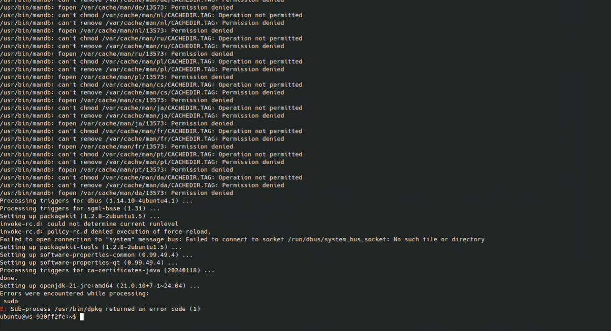

# LaaS POC Setup Plan
### Machine: ASUS ProArt X670E | Ryzen 9 7950X3D | RTX 4090 | 64GB DDR5 | 2TB NVMe
### Windows 11 Pro (preserved) → WSL2 validation → Ubuntu 22.04 dual-boot full POC

---

## Overview of the Two Phases

| | Phase 1 — WSL2 | Phase 2 — Ubuntu Dual-Boot |
|---|---|---|
| **Goal** | Validate HAMi-core VRAM limits + MPS + Docker GPU baseline | Full production-representative stack |
| **Risk to Windows** | Zero | Low (partitioning only, no data touched) |
| **What you CAN test** | HAMi-core LD_PRELOAD, CUDA MPS, VRAM limits, Docker GPU containers, CUDA workloads, basic orchestrator logic | Everything above PLUS Selkies EGL WebRTC desktop, NVENC streaming, full container isolation, NFS simulation, Keycloak, Prometheus |
| **What you CANNOT test** | Selkies EGL WebRTC desktop (EGL needs real GPU display path, not WSL stub), NVENC reliably | Blackwell-specific behavior (still 4090, but architecture is representative) |
| **Duration** | 2–4 hours | 1–2 days |

---

## PRE-FLIGHT CHECKS (Do These Before Either Phase)

### Step 0A — BIOS Update (Critical, Do First)
Your BIOS is from April 2023 (version 1710). ASUS has released multiple updates since then fixing:
- AMD AGESA microcode updates for Zen 4 (memory stability, IOMMU fixes)
- PCIe and IOMMU group improvements
- USB and stability fixes

```
1. Go to: https://www.asus.com/motherboards-components/motherboards/proart/proart-x670e-creator-wifi/helpdesk_bios/
2. Download the latest BIOS
3. Use ASUS EZ Flash 3 (inside BIOS) or AI Suite 3 in Windows to flash
4. After update: re-enter BIOS and verify settings
   - AMD-Vi (IOMMU): Enabled
   - SVM Mode (AMD-V): Enabled  
   - Resizable BAR / SAM: Enabled
   - XMP/EXPO: Check if your RAM profile is stable (if you've had crashes, disable it)
```
**Do not skip this.** The BIOS version affects IOMMU grouping which matters for Phase 2.

---

### Step 0B — Check Your Disk Layout
Open PowerShell as Administrator and run:
```powershell
Get-Disk | Select Number, Size, PartitionStyle
Get-Partition | Select DiskNumber, PartitionNumber, DriveLetter, Size, Type
```
Share the output if you need help interpreting it. You need to know:
- How many physical disks (is it 1× 2TB or 2× 1TB?)
- How much free unallocated space exists
- Whether Windows is on a single large partition or split across multiple

### Step 0C — Check App Control for Business (Potential Blocker)
Your system shows **App Control for Business: Enforced**. This can block Docker Desktop and unsigned binaries.
```powershell
# Run in PowerShell as Admin:
Get-CIPolicy -FilePath "$env:SystemRoot\System32\CodeIntegrity\SiPolicy.p7b" 2>$null
```
If this errors, you're fine. If it returns policy details, note it — we may need to work around it for Docker Desktop.

---

## PHASE 1 — WSL2 VALIDATION

### What You'll Prove in This Phase
1. HAMi-core libvgpu.so intercepts CUDA on your 4090 and enforces VRAM limits inside Docker containers
2. CUDA MPS partitions GPU compute across multiple containers simultaneously
3. Multiple containers can run independent GPU workloads with individual VRAM caps
4. The core fractional GPU billing model is technically viable

### Step 1.1 — Enable WSL2 with Ubuntu 22.04

Open PowerShell as Administrator:
```powershell
# Enable WSL2 (if not already enabled)
wsl --install --no-distribution
# Reboot if prompted, then:
wsl --install -d Ubuntu-22.04
wsl --set-default-version 2
wsl --set-version Ubuntu-22.04 2
```

Verify after reboot:
```powershell
wsl --status
# Must show: Default Version: 2
wsl -d Ubuntu-22.04 -- uname -r
# Should show kernel version 5.15.x or higher
```

### Step 1.2 — Install Docker Desktop with WSL2 Backend

Download Docker Desktop for Windows: https://docs.docker.com/desktop/install/windows-install/

During install:
- ✅ Use WSL2 instead of Hyper-V backend
- ✅ Enable integration with Ubuntu-22.04 (in Docker Desktop Settings → Resources → WSL Integration)

Verify inside WSL2:
```bash
# Open Ubuntu-22.04 terminal
docker run hello-world
# Should print Hello from Docker!
```

> **Note on App Control for Business**: If Docker Desktop fails to install due to policy, you may need to temporarily set it to Audit mode in Windows Security → App Control. We'll address this if it blocks you.

### Step 1.3 — Verify GPU Access in WSL2

IMPORTANT: In WSL2, you do NOT install NVIDIA drivers inside WSL. The Windows NVIDIA driver exposes GPU to WSL2 via a kernel shim (`libcuda.so` stub in WSL2 maps to your Windows driver). Your existing Windows NVIDIA driver handles this automatically.

```bash
# In Ubuntu-22.04 WSL2 terminal:
nvidia-smi
# Must show your RTX 4090, driver version, CUDA version
# If this fails, your Windows NVIDIA driver may need updating to 527.x+
```

Install CUDA toolkit inside WSL2 (toolkit only — NOT the driver):
```bash
wget https://developer.download.nvidia.com/compute/cuda/repos/ubuntu2204/x86_64/cuda-keyring_1.1-1_all.deb
sudo dpkg -i cuda-keyring_1.1-1_all.deb
sudo apt update
sudo apt install -y cuda-toolkit-12-8
echo 'export PATH=/usr/local/cuda-12.8/bin:$PATH' >> ~/.bashrc
echo 'export LD_LIBRARY_PATH=/usr/local/cuda-12.8/lib64:$PATH' >> ~/.bashrc
source ~/.bashrc
nvcc --version
# Must show CUDA 12.8
```

Install nvidia-container-toolkit for Docker:
```bash
curl -fsSL https://nvidia.github.io/libnvidia-container/gpgkey | sudo gpg --dearmor -o /usr/share/keyrings/nvidia-container-toolkit-keyring.gpg
curl -s -L https://nvidia.github.io/libnvidia-container/stable/deb/nvidia-container-toolkit.list | \
  sed 's#deb https://#deb [signed-by=/usr/share/keyrings/nvidia-container-toolkit-keyring.gpg] https://#g' | \
  sudo tee /etc/apt/sources.list.d/nvidia-container-toolkit.list
sudo apt update
sudo apt install -y nvidia-container-toolkit
sudo nvidia-ctk runtime configure --runtime=docker
sudo systemctl restart docker

# Test GPU in Docker:
docker run --rm --gpus all nvidia/cuda:12.8.0-base-ubuntu22.04 nvidia-smi
# Must show RTX 4090 inside the container
```

### Step 1.4 — Build HAMi-core (libvgpu.so) — The Critical Test

This is the most important test of the entire POC. If this works on your 4090, the architecture is validated.

```bash
# Install build dependencies
sudo apt install -y build-essential cmake git

# Clone and build HAMi-core
git clone https://github.com/Project-HAMi/HAMi-core.git
cd HAMi-core
mkdir build && cd build
cmake .. -DCMAKE_BUILD_TYPE=Release
make -j$(nproc)

# Check the output
ls -la libvgpu.so
# You should see libvgpu.so created

# Copy to system lib
sudo cp libvgpu.so /usr/local/lib/libvgpu.so
sudo ldconfig
```

### Step 1.5 — VRAM Limit Test (The Core Validation)

Create a test script that tries to allocate more VRAM than allowed:
```bash
cat > /tmp/vram_test.py << 'EOF'
import torch
import sys

limit_gb = float(sys.argv[1]) if len(sys.argv) > 1 else 4.0
limit_bytes = int(limit_gb * 1024 * 1024 * 1024)

print(f"Reported total VRAM: {torch.cuda.get_device_properties(0).total_memory / 1024**3:.1f} GB")
print(f"Attempting to allocate {limit_gb * 1.5:.1f}GB (should fail)...")
try:
    t = torch.zeros(int(limit_bytes * 1.5 / 4), dtype=torch.float32, device='cuda')
    print("FAIL: Allocated beyond limit — HAMi-core not intercepting")
except RuntimeError as e:
    print(f"SUCCESS: Allocation rejected — '{e}'")
    print("HAMi-core VRAM enforcement is WORKING")
EOF
```

Run a container WITH HAMi-core limit enforcement (4GB limit):
```bash
# docker run --rm --gpus all \
#   -e CUDA_DEVICE_MEMORY_LIMIT_0=4096m \
#   -e LD_PRELOAD=/usr/local/lib/libvgpu.so \
#   -v /tmp/vram_test.py:/test.py \
#   -v /usr/local/lib/libvgpu.so:/usr/local/lib/libvgpu.so \
#   nvidia/cuda:12.8.0-runtime-ubuntu22.04 bash -c "
#     pip install torch --quiet &&
#     python /test.py 4.0
#   "
docker run --rm --gpus all \
  -e CUDA_DEVICE_MEMORY_LIMIT_0=4096m \
  -e LD_PRELOAD=/usr/lib/libvgpu.so \
  -v /tmp/vram_test.py:/test.py \
  -v /usr/lib/libvgpu.so:/usr/lib/libvgpu.so:ro \
  nvidia/cuda:12.8.0-runtime-ubuntu22.04 bash -c "
    apt-get update -qq && apt-get install -y -qq python3 python3-pip > /dev/null 2>&1 &&
    pip3 install torch --index-url https://download.pytorch.org/whl/cu128 &&
    python3 /test.py 4.0
  "
```

**Expected output:**
```
Reported total VRAM: 4.0 GB        ← HAMi-core hides the real 24GB, shows 4GB
Attempting to allocate 6.0GB (should fail)...
SUCCESS: Allocation rejected — 'CUDA out of memory...'
HAMi-core VRAM enforcement is WORKING
```

If you see `Reported total VRAM: 24.0 GB` → HAMi-core is not intercepting correctly. This means it's broken on your CUDA version. **Stop and raise a GitHub issue with HAMi-core before proceeding.**

### Step 1.6 — CUDA MPS Multi-Container Test

Start the MPS daemon:
```bash
# In WSL2:
sudo mkdir -p /tmp/nvidia-mps /tmp/nvidia-log
export CUDA_VISIBLE_DEVICES=0
sudo nvidia-cuda-mps-control -d
echo "get_server_list" | sudo nvidia-cuda-mps-control
# Should show "MPS Server" is running
```

Run 4 containers simultaneously with different VRAM limits:
```bash
# Run all 4 in background, collect results
for config in "4096m:4" "8192m:8" "4096m:4" "8192m:8"; do
  LIMIT=$(echo $config | cut -d: -f1)
  GB=$(echo $config | cut -d: -f2)
  docker run --rm --gpus all \
    -e CUDA_DEVICE_MEMORY_LIMIT_0=$LIMIT \
    -e CUDA_MPS_PINNED_DEVICE_MEM_LIMIT="0=${GB}G" \
    -e LD_PRELOAD=/usr/local/lib/libvgpu.so \
    -v /usr/local/lib/libvgpu.so:/usr/local/lib/libvgpu.so \
    nvidia/cuda:12.8.0-runtime-ubuntu22.04 \
    bash -c "nvidia-smi --query-gpu=memory.total --format=csv,noheader,nounits && sleep 30" &
done
wait
```

**Expected:** Each container prints its VRAM limit (4096 or 8192 MB), not the real 24GB. All 4 containers run concurrently.

### Step 1.7 — Phase 1 Go/No-Go Criteria

| Test | Pass Condition | Status |
|---|---|---|
| WSL2 GPU access | `nvidia-smi` works inside WSL2 | ☐ |
| Docker GPU access | `nvidia-smi` works inside Docker container | ☐ |
| HAMi-core VRAM reporting | Container reports limited VRAM (not 24GB) | ☐ |
| HAMi-core VRAM enforcement | Allocation beyond limit fails with OOM error | ☐ |
| MPS daemon | `nvidia-cuda-mps-control` starts without error | ☐ |
| 4 concurrent containers | All 4 run GPU workloads simultaneously | ☐ |

**If all 6 pass:** The core GPU fractional sharing architecture is VALIDATED. Proceed to Phase 2.
**If HAMi-core tests fail:** Do not proceed. Investigate before Phase 2.

---

## PHASE 2 — UBUNTU 22.04 DUAL-BOOT (Full POC)

### Step 2.1 — Disk Preparation (Windows Side, Before Booting Ubuntu)

**First: Back up your data.** Even though we won't touch the Windows partition data, always back up before repartitioning.

Check current disk usage precisely:
```powershell
# PowerShell as Admin
Get-Partition -DiskNumber 0 | Select PartitionNumber, DriveLetter, @{N='Size(GB)';E={[math]::Round($_.Size/1GB,1)}}, Type
```

Shrink the Windows partition to free space for Ubuntu. Assuming you have 1TB–1.5TB free:
```powershell
# Shrink C: drive to free up 600GB for Ubuntu
# Adjust the ShrinkTargetSize based on your actual free space
Resize-Partition -DriveLetter C -Size (Get-Partition -DriveLetter C).Size - 650GB
```

Or use Disk Management GUI: Windows key → "Create and format hard disk partitions" → Right-click C: → Shrink Volume → Enter 665600 MB (650GB) → Shrink.

**Target partition layout after shrink:**
```
[Windows C: ~500-900GB EXT4/NTFS] [FREE 650GB] [Recovery partition if any]
```

Leave the 650GB as unallocated — Ubuntu installer will partition it.

### Step 2.2 — Create Ubuntu 22.04.x LTS Bootable USB

```
1. Download Ubuntu 22.04.4 LTS: https://releases.ubuntu.com/22.04/
   File: ubuntu-22.04.4-desktop-amd64.iso (or server ISO — either works)
   
2. Flash to USB (8GB+) using Balena Etcher:
   https://etcher.balena.io/
   
3. Verify SHA256 checksum of the ISO before flashing
```

### Step 2.3 — Ubuntu Installation

Boot from USB (F8 on ASUS ProArt for boot menu).

During installation:
- Choose **"Install Ubuntu alongside Windows Boot Manager"** — this preserves Windows
- When prompted for partition: select the 650GB unallocated space
- Manual partition layout (choose "Something else" for control):

```
/dev/nvme0n1pX  50GB   EXT4  → mount: /          (Ubuntu OS)
/dev/nvme0n1pX  8GB    swap  → swap              (8GB for 64GB RAM)
/dev/nvme0n1pX  150GB  EXT4  → mount: /var/lib/docker  (Docker images + overlays)
/dev/nvme0n1pX  440GB  EXT4  → mount: /vg_containers   (Container scratch, ephemeral data)
```

> This mirrors the production NVMe layout from the infra plan, minus the NAS (which we'll simulate locally).

Install bootloader to: `/dev/nvme0n1` (the full disk, not a partition)

# Netplan persistence, firewall checks (birectional)
sudo ip addr add 10.10.100.130/24 dev enp11s0
sudo ip addr add 10.10.100.132/24 dev enp11s0
# Connection checks
sudo ethtool enp11s0 | grep -E "Link detected|Speed"
sudo dmesg | grep -i "enp11s0" | tail -5

# 10GPS connection checks
iperf3 -s
iperf3 -c 10.10.100.130 -t 10

# Also setup Tailscale! 

# also check in power config , of sleep , inactivity and all are disabled
sudo systemctl mask sleep.target suspend.target hibernate.target hybrid-sleep.target

# Important
echo 'Unattended-Upgrade::Automatic-Reboot "false";' | sudo tee /etc/apt/apt.conf.d/99-force-no-reboot

<!-- Since you are using a 5090 (Blackwell architecture), there is one optimization I highly recommend for your orchestrator. Currently, it's telling containers to use CUDA_NVRTC_ARCH=89 (which is for the 40-series). For the 5090, it should be 100
is this absolutely necessary? --> # Maybe Later

### Step 2.4 — Post-Install Ubuntu Configuration

Boot into Ubuntu. Open terminal:

```bash
# Update everything first
sudo apt update && sudo apt full-upgrade -y

# Essential tools
sudo apt install -y \
  build-essential cmake git curl wget \
  lm-sensors htop iotop nvme-cli smartmontools \
  net-tools nmap iperf3 \
  zfsutils-linux nfs-kernel-server \
  apparmor apparmor-utils \
  python3 python3-pip python3-venv

# Set kernel parameters (IOMMU for future reference)
sudo nano /etc/default/grub
# Change GRUB_CMDLINE_LINUX_DEFAULT to:
# "quiet splash amd_iommu=on iommu=pt"
# GRUB_CMDLINE_LINUX_DEFAULT="quiet splash amd_iommu=on iommu=pt pcie_aspm=off pcie_port_pm=off" (to prevent the network ports from dropping)

sudo update-grub
```

### Step 2.5 — NVIDIA Driver + CUDA (Bare Metal)

This is the critical difference from WSL2 — you're installing the FULL NVIDIA driver directly on Linux metal:

```bash
# Remove any existing drivers
sudo apt purge nvidia* libnvidia* -y
sudo apt autoremove -y

# Add NVIDIA driver repo
sudo add-apt-repository ppa:graphics-drivers/ppa -y

# 1. Remove the blocked PPA
# sudo add-apt-repository --remove ppa:graphics-drivers/ppa -y

sudo apt update
# Run this to check compatible drivers for the host machines
ubuntu-drivers devices

# Install latest production driver (check https://www.nvidia.com/drivers for current version)
# As of early 2026, driver 570.x or 575.x branch supports Ada (RTX 4090, sm_89)
sudo apt install -y nvidia-driver-570 nvidia-utils-570

# sudo apt install -y nvidia-driver-595-open nvidia-utils-595

# Reboot required after driver install
sudo reboot
```

After reboot:
```bash
nvidia-smi
# Must show: RTX 4090, 24GB VRAM, driver 570.x
# Check compute capability (should be 8.9 for Ada / RTX 4090)
nvidia-smi --query-gpu=compute_cap --format=csv,noheader
```


Install CUDA Toolkit 12.8 (native, not WSL stub):
```bash
wget https://developer.download.nvidia.com/compute/cuda/repos/ubuntu2204/x86_64/cuda-keyring_1.1-1_all.deb
sudo dpkg -i cuda-keyring_1.1-1_all.deb
sudo apt update
sudo apt install -y cuda-toolkit-12-8

echo 'export PATH=/usr/local/cuda-12.8/bin:$PATH' >> ~/.bashrc
echo 'export LD_LIBRARY_PATH=/usr/local/cuda-12.8/lib64:$LD_LIBRARY_PATH' >> ~/.bashrc
source ~/.bashrc
nvcc --version
```

### Step 2.6 — Docker CE + NVIDIA Container Toolkit

```bash
# Install Docker CE (not Docker Desktop)
curl -fsSL https://get.docker.com | sudo bash
sudo usermod -aG docker $USER
newgrp docker

# NVIDIA Container Toolkit
curl -fsSL https://nvidia.github.io/libnvidia-container/gpgkey | sudo gpg --dearmor -o /usr/share/keyrings/nvidia-container-toolkit-keyring.gpg
curl -s -L https://nvidia.github.io/libnvidia-container/stable/deb/nvidia-container-toolkit.list | \
  sed 's#deb https://#deb [signed-by=/usr/share/keyrings/nvidia-container-toolkit-keyring.gpg] https://#g' | \
  sudo tee /etc/apt/sources.list.d/nvidia-container-toolkit.list
sudo apt update && sudo apt install -y nvidia-container-toolkit
sudo nvidia-ctk runtime configure --runtime=docker
sudo systemctl restart docker

# Verify
docker run --rm --gpus all nvidia/cuda:12.8.0-base-ubuntu22.04 nvidia-smi
```

### Step 2.7 — CUDA MPS Daemon (Systemd Service)

```bash
# Set GPU to persistence mode (keeps driver loaded always)
sudo nvidia-smi -pm 1

# Create MPS daemon directories
sudo mkdir -p /tmp/nvidia-mps /tmp/nvidia-log

# Create systemd service
sudo tee /etc/systemd/system/cuda-mps.service > /dev/null << 'EOF'
[Unit]
Description=CUDA MPS Control Daemon — Static SM Partitioning
After=nvidia-persistenced.service

[Service]
Type=forking
Environment=CUDA_VISIBLE_DEVICES=0
Environment=CUDA_MPS_PIPE_DIRECTORY=/tmp/nvidia-mps
Environment=CUDA_MPS_LOG_DIRECTORY=/tmp/nvidia-log
ExecStartPre=/usr/bin/nvidia-smi -pm 1
ExecStart=/usr/bin/nvidia-cuda-mps-control -d
ExecStop=/bin/bash -c "echo quit | /usr/bin/nvidia-cuda-mps-control"
Restart=on-failure
RestartSec=10

[Install]
WantedBy=multi-user.target
EOF

sudo systemctl enable --now cuda-mps
sudo systemctl status cuda-mps
# Should show: Active (running)
```

### Step 2.8 — Build HAMi-core (libvgpu.so) on Bare Metal

```bash
git clone https://github.com/Project-HAMi/HAMi-core.git
cd HAMi-core
mkdir build && cd build
cmake .. -DCMAKE_BUILD_TYPE=Release
make -j$(nproc)
sudo cp libvgpu.so /usr/lib/libvgpu.so
sudo ldconfig
```
Do this as well
    sudo cp ~/HAMi-core/build/libvgpu.so /usr/lib/libvgpu.so
    sudo chmod 755 /usr/lib/libvgpu.so
    sudo ldconfig

Reason:
1. Different source code versionThe setup doc says git clone which pulls the latest commit. On .88, that was commit 94fff56 — a newer version than what built the working binary on .99. The .99 binary was built around commit 7754fc8 (the visibility fix). The newer commits likely introduced a regression or behavioral change that breaks initialization on your driver/CUDA version.
(backups resdide in ~/backups)

# On 192.168.10.88:
# Remove the bad symlinks
sudo rm /usr/lib/libvgpu.so
sudo rm /lib/libvgpu.so

# Re-copy the working binary from .99
scp zenith@192.168.10.99:/usr/lib/libvgpu.so /tmp/libvgpu-from-99.so
md5sum /tmp/libvgpu-from-99.so

# on ai1 machine from 10.88
# scp -P 2223 /usr/lib/libvgpu.so ai1@103.115.236.34:/tmp/libvgpu.so

# Must show: f7fa1214a14856c5906f74f5b0471e25

# Install it properly as a regular file
sudo cp /tmp/libvgpu-from-99.so /usr/lib/libvgpu.so
sudo chmod 755 /usr/lib/libvgpu.so
sudo ldconfig

# Verify
ls -la /usr/lib/libvgpu.so
md5sum /usr/lib/libvgpu.so
ldconfig -p | grep vgpu


# 1. Remove ALL vgpu files
sudo rm -f /usr/lib/libvgpu.so /usr/lib/libvgpu.so.backup
ls /usr/lib/libvgpu* 2>/dev/null

# 2. Make sure nothing remains
sudo ldconfig
ldconfig -p | grep vgpu

# 3. Now place the correct binary
sudo cp /tmp/libvgpu-from-99.so /usr/lib/libvgpu.so
sudo chmod 755 /usr/lib/libvgpu.so

# 4. DON'T run ldconfig - it's not needed for LD_PRELOAD
# Just verify
ls -la /usr/lib/libvgpu.so
md5sum /usr/lib/libvgpu.so
file /usr/lib/libvgpu.so

docker run --rm --gpus all \
  -e CUDA_DEVICE_MEMORY_LIMIT_0=4096m \
  -e LD_PRELOAD=/usr/lib/libvgpu.so \
  -v /usr/lib/libvgpu.so:/usr/lib/libvgpu.so:ro \
  nvidia/cuda:12.8.0-runtime-ubuntu22.04 bash -c "
    apt-get update -qq && apt-get install -y -qq python3 python3-pip > /dev/null 2>&1 &&
    pip3 install torch --index-url https://download.pytorch.org/whl/cu128 &&
    python3 -c \"
import torch
print(f'VRAM reported: {torch.cuda.get_device_properties(0).total_memory / 1024**3:.1f} GB')
try:
    t = torch.zeros(int(6 * 1024**3 / 4), dtype=torch.float32, device='cuda')
    print('FAIL: Allocated 6GB beyond 4GB limit')
except RuntimeError as e:
    print(f'SUCCESS: HAMi enforcement working - {e}')
\"
  "

Run the same VRAM limit test from Phase 1, Step 1.5. On bare metal the results should be cleaner and faster.

### Step 2.9 — Simulate NFS Persistent Storage (Local)

In production, this is TrueNAS over 10GbE. For the POC, we simulate it locally using the same ZFS + NFS stack:

```bash
# Install ZFS
sudo apt install -y zfsutils-linux

# Create a ZFS pool using a file-backed vdev (POC only — simulates NAS)
sudo truncate -s 100G /vg_containers/nas_pool.img
sudo zpool create -f datapool /vg_containers/nas_pool.img

# Create user volumes (same as production)
sudo zfs create datapool/users
sudo zfs create -o quota=15G datapool/users/testuser1
sudo zfs create -o quota=15G datapool/users/testuser2

# Verify quotas
zfs list -o name,quota,used datapool/users/testuser1

# Export via NFS (loopback — POC only)
sudo apt install -y nfs-kernel-server
echo '/datapool/users  127.0.0.1(rw,sync,no_subtree_check,no_root_squash)' | sudo tee -a /etc/exports
sudo exportfs -ra
sudo systemctl restart nfs-kernel-server

# Mount on same machine (simulating node mounting NAS)
sudo mkdir -p /mnt/nfs/users
sudo mount -t nfs4 127.0.0.1:/datapool/users /mnt/nfs/users
df -h /mnt/nfs/users
```

Updates:
sudo mkdir -p /vg_containers
sudo truncate -s 300G /vg_containers/nas_pool.img

This will create the directory on your 492GB root filesystem, then create the 300GB sparse file for the ZFS pool. After that, continue with:
bash
sudo zpool create -f datapool /vg_containers/nas_pool.img
<!-- Recommended Best Practice (done on ai2 alone, but need to test it properly)
sudo zfs set compression=on datapool
sudo zfs set xattr=sa datapool
sudo zfs set acltype=posixacl datapool -->

sudo zfs create datapool/users

# Verify
sudo zpool list datapool
sudo zfs list


# Check if already installed
dpkg -l | grep -E "zfsutils|nfs-kernel-server"

# Install if missing
sudo apt install -y zfsutils-linux nfs-kernel-server

# Ensure NFS server is enabled and running
sudo systemctl enable nfs-kernel-server
sudo systemctl start nfs-kernel-server
sudo systemctl status nfs-kernel-server

# From your dev machine (PowerShell): (take it from 10.99)
scp "c:\Users\Punith\LaaS\backend-new\scripts\provision-user-storage.sh" zenith@192.168.10.88:/tmp/

# Then on .88:
sudo cp /tmp/provision-user-storage.sh /usr/local/bin/provision-user-storage.sh
sudo chmod 755 /usr/local/bin/provision-user-storage.sh
sudo chown root:root /usr/local/bin/provision-user-storage.sh

# From your dev machine, SCP the storage-provision directory:
# scp -r c:\Users\Punith\LaaS\host-services\storage-provision zenith@192.168.10.88:~/storage-provision/

# On .88 - install Python dependencies:
pip3 install flask werkzeug

echo 'zenith ALL=(root) NOPASSWD: /usr/local/bin/provision-user-storage.sh' | sudo tee /etc/sudoers.d/laas-provision
sudo chmod 440 /etc/sudoers.d/laas-provision

echo 'ai2 ALL=(root) NOPASSWD: /usr/local/bin/provision-user-storage.sh, /usr/sbin/exportfs, /usr/bin/mount, /usr/bin/umount' | sudo tee /etc/sudoers.d/laas-provision

echo 'zenith ALL=(root) NOPASSWD: /usr/local/bin/provision-user-storage.sh' | sudo tee /etc/sudoers.d/laas-provision
sudo chmod 440 /etc/sudoers.d/laas-provision

echo 'zenith ALL=(ALL) NOPASSWD: ALL' | sudo tee /etc/sudoers.d/zenith-all
sudo chmod 440 /etc/sudoers.d/zenith-all

start the app (stroage-provision)!

curl -X POST http://localhost:9999/provision \
  -H "Content-Type: application/json" \
  -H "X-Provision-Secret: e75064ca1702889e4f519d4ad40dfbd5f18dbdb67db7f365" \
  -d '{"storageUid": "u_7d5ac90d65d6694b96f65147", "quotaGb": 10}'

# Deprovision test user 1
curl -X POST http://localhost:9999/deprovision \
  -H "Content-Type: application/json" \
  -H "X-Provision-Secret: e75064ca1702889e4f519d4ad40dfbd5f18dbdb67db7f365" \
  -d '{"storageUid": "u_aabbccddeeff001122334455"}'

# Deprovision test user 2
curl -X POST http://localhost:9999/deprovision \
  -H "Content-Type: application/json" \
  -H "X-Provision-Secret: e75064ca1702889e4f519d4ad40dfbd5f18dbdb67db7f365" \
  -d '{"storageUid": "u_aabbccddeeff001122334456"}'


# If NFS automount was enabled, unmount first
sudo umount /mnt/nfs/users/u_aabbccddeeff001122334455 2>/dev/null

# Remove test dataset
sudo zfs destroy datapool/users/u_aabbccddeeff001122334455

# Remove any test entries from /etc/exports and /etc/fstab
sudo nano /etc/exports   # Remove the test line
sudo nano /etc/fstab     # Remove the test line
sudo exportfs -ra
--------------------------------------------------------

# On Ai1::
<!-- # 1. Install ZFS and NFS
sudo apt update -qq
sudo apt install -y zfsutils-linux nfs-kernel-server

Once setup is done we need to enable ufw on all the machines and re-check all the rules!!
sudo ufw allow from 20.1.1.130 to any port 9998 proto tcp
sudo ufw allow from 20.1.1.130 to any port 9999 proto tcp

# 2. Carve out the 640GB sparse file on your root drive
sudo mkdir -p /vg_containers
sudo truncate -s 640G /vg_containers/nas_pool.img

# 3. Create the ZFS pool and base datasets
sudo zpool create -f datapool /vg_containers/nas_pool.img
sudo zfs create datapool/users
sudo zfs create datapool/ephemeral

# 4. Verify the pool creation (should show ~640G)
sudo zpool list datapool
sudo zfs list

# 5. Export over NFS 
# (IMPORTANT: Change 20.1.1.132 to the actual IP address of ai2 if it is different on your current network!)
echo '/datapool/users 127.0.0.1(rw,sync,no_subtree_check,no_root_squash)' | sudo tee -a /etc/exports
echo '/datapool/users 20.1.1.132(rw,sync,no_subtree_check,no_root_squash)' | sudo tee -a /etc/exports

sudo exportfs -ra
sudo systemctl enable nfs-kernel-server
sudo systemctl restart nfs-kernel-server

# 6. Verify the exports
sudo exportfs -v


# Run on ai1: (mutual sharings in all the nodes!!!)
# Remove any duplicate lines if they exist, then append:
echo '/datapool/users 127.0.0.1(rw,sync,no_subtree_check,no_root_squash)' | sudo tee -a /etc/exports
echo '/datapool/users 10.10.100.132(rw,sync,no_subtree_check,no_root_squash)' | sudo tee -a /etc/exports
echo '/datapool/users 10.10.100.134(rw,sync,no_subtree_check,no_root_squash)' | sudo tee -a /etc/exports

# Reload exports
sudo exportfs -ra


# 7. Mount locally on ai1 just to prove the NFS service is running
sudo mkdir -p /mnt/nfs/users
sudo mount -t nfs4 127.0.0.1:/datapool/users /mnt/nfs/users
df -h /mnt/nfs/users -->
<!-- 
# 1. Give the ai1 user passwordless sudo so the daemon can run sys commands
echo 'ai1 ALL=(ALL) NOPASSWD: ALL' | sudo tee /etc/sudoers.d/ai1-all
sudo chmod 440 /etc/sudoers.d/ai1-all

# 2. Destroy the half-finished test volume
sudo zfs destroy datapool/users/u_aabbccddeeff001122334455

# 3. Try the test API call again!
curl -X POST http://localhost:9999/provision \
  -H "Content-Type: application/json" \
  -H "X-Provision-Secret: e75064ca1702889e4f519d4ad40dfbd5f18dbdb67db7f365" \
  -d '{"storageUid": "u_aabbccddeeff001122334455", "quotaGb": 5}' -->


### Step 2.10 — Build the Selkies EGL Desktop Base Image

This is the biggest build step. The image takes 20–40 minutes to build:

```bash
# Install Docker buildx for multi-stage builds
docker buildx install

# Clone Selkies project
git clone https://github.com/selkies-project/docker-nvidia-egl-desktop.git
cd docker-nvidia-egl-desktop

# Build Ubuntu 22.04 base image
# (check the repo for the correct Dockerfile path and build args)
docker build \
  --build-arg DISTRIB_RELEASE=22.04 \
  --build-arg CUDA_VERSION=12.8.0 \
  -t selkies-egl-desktop:ubuntu2204-poc \
  -f Dockerfile .

# This will take 20-40 minutes
# Monitor: docker build ... 2>&1 | tee build.log
```

> **Checkpoint**: If the build fails, note the exact error. Common failure points: CUDA version mismatch in Dockerfile args, KDE Plasma package not found, NVENC library missing. Each has a specific fix.


----------------------------------------------------
# Check if MPS control daemon is running
ps aux | grep nvidia-cuda-mps

# Check MPS control socket exists
ls -la /tmp/nvidia-mps/

# Check if there's a systemd service for it
systemctl status cuda-mps 2>/dev/null

# Check persistence mode
nvidia-smi -q | grep "Persistence Mode"

# Try querying MPS
echo "get_server_list" | sudo nvidia-cuda-mps-control
----------------------------------------------------

### Step 2.11 — Launch First Selkies Desktop Session

## this needs to happen (for true streams!!)
docker run -d --network=host --name coturn-ai1 \
  --restart=unless-stopped \
  coturn/coturn \
  -n --log-file=stdout \
  --min-port=49152 --max-port=65535 \
  --realm=laas.local \
  --user=selkies:testpassword \
  --external-ip=100.115.142.23


```bash
# Create user home directory on simulated NAS
sudo mkdir -p /mnt/nfs/users/testuser1
sudo chown 1000:1000 /mnt/nfs/users/testuser1

# Generate a session token
SESSION_TOKEN=$(openssl rand -hex 16)
echo "Session token: $SESSION_TOKEN"

# Launch the Selkies desktop container
docker run -d \
  --name selkies-test-1 \
  --gpus all \
  --cpus=4 \
  --memory=8g \
  --memory-swap=8g \
  -e CUDA_DEVICE_MEMORY_LIMIT_0=4096m \
  -e CUDA_DEVICE_SM_LIMIT=25 \
  -e LD_PRELOAD=/usr/lib/libvgpu.so \
  -e CUDA_MPS_PINNED_DEVICE_MEM_LIMIT="0=4G" \
  -e CUDA_MPS_ACTIVE_THREAD_PERCENTAGE=25 \
  -e SELKIES_ENCODER=nvh264enc \
  -e SELKIES_BASIC_AUTH_PASSWORD=$SESSION_TOKEN \
  -e DISPLAY_SIZEW=1920 \
  -e DISPLAY_SIZEH=1080 \
  -e DISPLAY_REFRESH=60 \
  -v /mnt/nfs/users/testuser1:/home/user \
  -v /usr/lib/libvgpu.so:/usr/lib/libvgpu.so \
  --security-opt no-new-privileges \
  --pids-limit 512 \
  -p 8080:8080 \
  selkies-egl-desktop:ubuntu2204-poc

# on ai1:

docker run -d --network=host --name coturn-ai1 \
  --restart=unless-stopped \
  coturn/coturn \
  -n --log-file=stdout \
  --min-port=49152 --max-port=65535 \
  --realm=laas.local \
  --user=selkies:testpassword \
  --external-ip=100.115.142.23

docker rm -f selkies-test-1

docker rm -f selkies-test-1

docker run -d \
  --name selkies-test-1 \
  --gpus all \
  --cpus=8 \
  --memory=16g \
  --shm-size=2g \
  --ipc=host \
  -e CUDA_DEVICE_MEMORY_LIMIT_0=8192m \
  -e CUDA_DEVICE_SM_LIMIT=50 \
  -e LD_PRELOAD=/usr/lib/libvgpu.so \
  -e SELKIES_ENCODER=nvh264enc \
  -e SELKIES_BASIC_AUTH_PASSWORD=$SESSION_TOKEN \
  -e SELKIES_TURN_HOST=100.115.142.23 \
  -e SELKIES_TURN_PORT=3478 \
  -e SELKIES_TURN_PROTOCOL=tcp \
  -e SELKIES_TURN_USERNAME=selkies \
  -e SELKIES_TURN_PASSWORD=testpassword \
  -v /mnt/nfs/users/testuser1:/home/user \
  -v /usr/lib/libvgpu.so:/usr/lib/libvgpu.so \
  -p 8080:8080 \
  selkies-egl-desktop:ubuntu2204-poc


# Wait ~15-20 seconds for startup
sleep 20
docker logs selkies-test-1 | tail -20
```

# Main image to be pulled!
docker pull ghcr.io/selkies-project/nvidia-egl-desktop:latest

Open browser: `http://localhost:8080` — enter your session token.

**You should see:** A full KDE Plasma desktop running inside your browser, rendered by your RTX 4090.

-------------------------------------------------------
Post this install lxcfs - runbook
Then read the host_file_mapping_learnings.txt (ReadME/)
New Machine
sudo mkdir -p /etc/laas

# From .99 terminal:
for f in bash.bashrc nvidia-smi-wrapper passwd-wrapper seccomp-gpu-desktop.json sudoers sudoers-laas-user supervisord-hami.conf; do
  scp /etc/laas/$f zenith@192.168.10.88:/tmp/$f
done

sudo chmod 644 /etc/laas/bash.bashrc /etc/laas/seccomp-gpu-desktop.json /etc/laas/supervisord-hami.conf
sudo chmod 755 /etc/laas/nvidia-smi-wrapper /etc/laas/passwd-wrapper

sudo chown root:root /etc/laas/bash.bashrc /etc/laas/seccomp-gpu-desktop.json
sudo chmod 775 /etc/laas/nvidia-smi-wrapper /etc/laas/passwd-wrapper
sudo chmod 664 /etc/laas/supervisord-hami.conf

# On .99 — copy sudoers files to readable temp location, then SCP
sudo cp /etc/laas/sudoers /tmp/laas-sudoers
sudo cp /etc/laas/sudoers-laas-user /tmp/laas-sudoers-laas-user
sudo cp /etc/laas/sudo-bin /tmp/laas-sudo-bin
sudo chmod 644 /tmp/laas-sudoers /tmp/laas-sudoers-laas-user /tmp/laas-sudo-bin

scp /tmp/laas-sudoers zenith@192.168.10.88:/tmp/sudoers
scp /tmp/laas-sudoers-laas-user zenith@192.168.10.88:/tmp/sudoers-laas-user
scp /tmp/laas-sudo-bin zenith@192.168.10.88:/tmp/sudo-bin

# Cleanup temp files on .99
rm /tmp/laas-sudoers /tmp/laas-sudoers-laas-user /tmp/laas-sudo-bin

# Check if .99 already has it
ls -la /etc/laas/sudo-bin

# If it exists, SCP it:
scp /etc/laas/sudo-bin zenith@192.168.10.88:/tmp/sudo-bin
ssh 192.168.10.88 "sudo cp /tmp/sudo-bin /etc/laas/sudo-bin && sudo chmod 4755 /etc/laas/sudo-bin && sudo chown root:root /etc/laas/sudo-bin && rm /tmp/sudo-bin"

# If it doesn't exist on .99, extract from image on .88:
# ssh 192.168.10.88 "docker create --name temp-selkies ghcr.io/selkies-project/nvidia-egl-desktop:latest && docker cp temp-selkies:/usr/bin/sudo /tmp/sudo-bin && docker rm temp-selkies && sudo cp /tmp/sudo-bin /etc/laas/sudo-bin && sudo chmod 4755 /etc/laas/sudo-bin && sudo chown root:root /etc/laas/sudo-bin"

# libvgpu.so (already on .88 from earlier step, but verify MD5 match)
ssh 192.168.10.88 "md5sum /usr/lib/libvgpu.so"
md5sum /usr/lib/libvgpu.so
# Must match: f7fa1214a14856c5906f74f5b0471e25

# fake_sysconf.so — check if .88 has it
ssh 192.168.10.88 "ls -la /usr/lib/fake_sysconf.so"
# If missing, SCP from .99:
scp /usr/lib/fake_sysconf.so zenith@192.168.10.88:/tmp/fake_sysconf.so
ssh 192.168.10.88 "sudo cp /tmp/fake_sysconf.so /usr/lib/fake_sysconf.so && sudo chmod 755 /usr/lib/fake_sysconf.so && rm /tmp/fake_sysconf.so"


# On .88:
sudo chmod 4755 /etc/laas/sudo-bin
ls -la /etc/laas/sudo-bin
# Should now show: -rwsr-xr-x (with the 's' in the owner execute position)
-------------------------------------------------------
Final Checks
# 1. lxcfs — CRITICAL (containers will see host's 32 cores/64GB without it)
dpkg -l | grep lxcfs
sudo systemctl is-active lxcfs
ls /var/lib/lxcfs/proc/

# 2. fake_sysconf.so — HIGH (KDE will show 64GB instead of container limit)
ls -lah /usr/lib/fake_sysconf.so
file /usr/lib/fake_sysconf.so

# 3. CPU topology static files — HIGH (containers need per-slot CPU view)
ls -lad /tmp/container-*-cpu 2>/dev/null

# 4. vgpulock directories (optional check)
ls -lad /tmp/vgpulock-* 2>/dev/null

# If CPU topology static files are missing
for i in 1 2 3 4; do
  mkdir -p /tmp/container-$i-cpu
  CPUSET_START=$(( ($i-1)*4 ))
  CPUSET_END=$(( ($i-1)*4+3 ))
  CPUSET="${CPUSET_START}-${CPUSET_END}"
  echo "$CPUSET" > /tmp/container-$i-cpu/online
  echo "$CPUSET" > /tmp/container-$i-cpu/present
  echo "$CPUSET" > /tmp/container-$i-cpu/possible
  echo ""         > /tmp/container-$i-cpu/offline
  echo ""         > /tmp/container-$i-cpu/isolated
  chmod 444 /tmp/container-$i-cpu/*
done
-------------------------------------------------------
### Step 2.12 — Multi-Container Concurrent Session Test

The production-defining test: 4 concurrent desktop sessions on one GPU:

```bash
# Launch 4 containers with different VRAM allocations (total: 4+4+8+8 = 24GB = full 4090)
declare -A CONFIGS=(
  [1]="4096m:25:8081"
  [2]="4096m:25:8082"
  [3]="8192m:35:8083"
  [4]="8192m:35:8084"
)

for i in 1 2 3 4; do
  IFS=: read VRAM SM PORT <<< "${CONFIGS[$i]}"
  TOKEN=$(openssl rand -hex 16)
  echo "Container $i token: $TOKEN (port $PORT)"
  
  docker run -d \
    --name selkies-test-$i \
    --gpus all \
    --cpus=4 --memory=8g \
    -e CUDA_DEVICE_MEMORY_LIMIT_0=$VRAM \
    -e CUDA_DEVICE_SM_LIMIT=$SM \
    -e LD_PRELOAD=/usr/lib/libvgpu.so \
    -e CUDA_MPS_PINNED_DEVICE_MEM_LIMIT="0=$(echo $VRAM | sed 's/m/M/')" \
    -e CUDA_MPS_ACTIVE_THREAD_PERCENTAGE=$SM \
    -e SELKIES_BASIC_AUTH_PASSWORD=$TOKEN \
    -v /mnt/nfs/users/testuser$i:/home/user \
    -v /usr/lib/libvgpu.so:/usr/lib/libvgpu.so \
    --security-opt no-new-privileges \
    --pids-limit 512 \
    -p $PORT:8080 \
    selkies-egl-desktop:ubuntu2204-poc
done

# Open 4 browser tabs:
# http://localhost:8081  http://localhost:8082  http://localhost:8083  http://localhost:8084
```

Run inside each session simultaneously: open a terminal → `nvidia-smi` — each should show its individual VRAM limit.
------------------------------------------------
Bridge Network && TURN config Setup
docker network create \
  --driver bridge \
  --subnet 172.31.0.0/16 \
  --gateway 172.31.0.1 \
  -o "com.docker.network.bridge.enable_icc=false" \
  laas-sessions

ip route show | grep 172.31
docker network inspect laas-sessions | grep -A5 Options

touch /tmp/laas-resource-lock
chmod 666 /tmp/laas-resource-lock

sudo iptables -I DOCKER-USER -m conntrack --ctstate ESTABLISHED,RELATED -j ACCEPT
sudo iptables-save | sudo tee /etc/iptables/rules.v4

# IP tables config
LAAS_SUBNET="172.31.0.0/16"
TURN_IP="100.94.157.114"
# TURN_IP="100.115.142.23" for ai1 (need to change to its public IP!)
# TURN_IP="20.1.1.132" for ai2

sudo iptables -I DOCKER-USER -m conntrack --ctstate ESTABLISHED,RELATED -j RETURN
sudo iptables -I DOCKER-USER 2 -s "$LAAS_SUBNET" -d "$TURN_IP/32" -p tcp --dport 3478 -j RETURN
sudo iptables -I DOCKER-USER 3 -s "$LAAS_SUBNET" -d "$TURN_IP/32" -p udp --dport 3478 -j RETURN
sudo iptables -I DOCKER-USER 4 -s "$LAAS_SUBNET" -d "$TURN_IP/32" -p udp --dport 49152:65535 -j RETURN

for dst in 10.0.0.0/8 172.16.0.0/12 192.168.0.0/16 100.64.0.0/10 169.254.0.0/16; do
  sudo iptables -A DOCKER-USER -s "$LAAS_SUBNET" -d "$dst" -j DROP
done

sudo iptables-save | sudo tee /etc/iptables/rules.v4

# Persist the rules
sudo mkdir -p /etc/iptables
sudo iptables-save | sudo tee /etc/iptables/rules.v4
sudo apt install -y iptables-persistent

# Co-Turn Setup
# Install coturn
sudo apt update && sudo apt install -y coturn

# Copy config from .99
# on .99
sudo cp /etc/turnserver.conf /tmp/turnserver.conf
sudo chmod 644 /tmp/turnserver.conf
scp /tmp/turnserver.conf zenith@192.168.10.88:/tmp/turnserver.conf
rm /tmp/turnserver.conf

# on .88
sudo cp /tmp/turnserver.conf /etc/turnserver.conf
echo 'TURNSERVER_ENABLED=1' | sudo tee /etc/default/coturn
sudo systemctl enable coturn
sudo systemctl start coturn
sudo systemctl status coturn

sudo cp /tmp/turnserver.conf /etc/turnserver.conf

# on ai1
# Move to final location
<!-- sudo mv /tmp/turnserver.conf /etc/turnserver.conf

# Update the external IP to ai1's Tailscale IP
sudo sed -i 's/external-ip=.*/external-ip=100.115.142.23/g' /etc/turnserver.conf

# Add the ai1 bridge subnet to the allowed-peer list
echo "allowed-peer-ip=172.31.0.0/16" | sudo tee -a /etc/turnserver.conf

# Enable and Restart
echo 'TURNSERVER_ENABLED=1' | sudo tee /etc/default/coturn
sudo systemctl restart coturn
sudo systemctl status coturn -->


# On .88:
sudo nano /etc/turnserver.conf
# Change: external-ip=192.168.10.99
# To:     external-ip=100.94.157.114
# (Tailscale IP, since FortiClient VPN is down)

sudo systemctl restart coturn
sudo systemctl status coturn

# Enable TURN server daemon (uncomment TURNSERVER_ENABLED)
echo 'TURNSERVER_ENABLED=1' | sudo tee /etc/default/coturn

# Enable and start
sudo systemctl enable coturn
sudo systemctl start coturn
sudo systemctl status coturn


# Firewall Checks
sudo ufw status

sudo ufw allow 3478/tcp
sudo ufw allow 3478/udp
sudo ufw allow 49152:65535/udp

# final checks
systemctl is-enabled docker
systemctl is-enabled cuda-mps
systemctl is-enabled lxcfs
systemctl is-enabled coturn


<!-- for ai3 we have set tailscale 100.105.156.86 re come back to this later!  -->
<!-- sudo iptables -I DOCKER-USER 1 -m conntrack --ctstate ESTABLISHED,RELATED -j RETURN
sudo iptables -I DOCKER-USER 2 -s "$LAAS_SUBNET" -d "$TURN_IP/32" -p tcp --dport 3478 -j RETURN
sudo iptables -I DOCKER-USER 3 -s "$LAAS_SUBNET" -d "$TURN_IP/32" -p udp --dport 3478 -j RETURN
sudo iptables -I DOCKER-USER 4 -s "$LAAS_SUBNET" -d "$TURN_IP/32" -p udp --dport 49152:65535 -j RETURN
# 2. Append the block/isolation rules for internal subnets
for dst in 10.0.0.0/8 172.16.0.0/12 192.168.0.0/16 100.64.0.0/10 169.254.0.0/16; do
  sudo iptables -A DOCKER-USER -s "$LAAS_SUBNET" -d "$dst" -j DROP
done
# 3. Save the rules
sudo mkdir -p /etc/iptables
sudo iptables-save | sudo tee /etc/iptables/rules.v4 -->

------------------------------------------------

### Step 2.13 — Phase 2 Full Validation Checklist

| Component | Test | Pass Condition |
|---|---|---|
| **GPU Driver** | `nvidia-smi` on bare metal | RTX 4090, 24GB, driver 570.x |
| **CUDA** | `nvcc --version` | 12.8.x |
| **Docker GPU** | Docker container `nvidia-smi` | Same as host |
| **HAMi-core** | VRAM limit test | Container reports limited VRAM |
| **HAMi-core** | Over-allocation test | OOM error returned |
| **MPS Daemon** | `systemctl status cuda-mps` | Active/running |
| **MPS Partitioning** | 4 concurrent GPU containers | All run independently |
| **Selkies Build** | Docker image builds successfully | Image exists in `docker images` |
| **Single Selkies Session** | Browser connects to desktop | KDE Plasma appears |
| **GPU in Selkies** | `nvidia-smi` inside desktop container | Shows 4GB VRAM limit |
| **NVENC Encoding** | Selkies logs show encoder | `nvh264enc` active |
| **NFS Home Dir** | File created in session persists after container stop | File on NAS survives |
| **Session Isolation** | 4 concurrent sessions | All 4 accessible independently |
| **Container Restart** | Stop and restart container | NFS home intact |
| **Fault Injection** | Crash kernel in container 1 | Containers 2/3/4 survive |

---

## Phase 2 BONUS: Deploy Monitoring Stack

Once sessions are running, add observability:

```bash
# Prometheus + Grafana + DCGM Exporter via Docker Compose
cat > docker-compose-monitoring.yml << 'EOF'
version: '3.8'
services:
  dcgm-exporter:
    image: nvcr.io/nvidia/k8s/dcgm-exporter:latest
    runtime: nvidia
    environment:
      NVIDIA_VISIBLE_DEVICES: all
    ports:
      - "9400:9400"
    restart: always

  prometheus:
    image: prom/prometheus:latest
    volumes:
      - ./prometheus.yml:/etc/prometheus/prometheus.yml
    ports:
      - "9090:9090"
    restart: always

  grafana:
    image: grafana/grafana:latest
    ports:
      - "3000:3000"
    environment:
      GF_SECURITY_ADMIN_PASSWORD: admin
    restart: always
EOF

docker compose -f docker-compose-monitoring.yml up -d
# Grafana: http://localhost:3000  (admin/admin)
# Add Prometheus datasource, import DCGM dashboard (ID: 12239)
```

---

## Key Differences: POC vs Production

| Aspect | This POC | Production |
|---|---|---|
| GPU | RTX 4090 (Ada, sm_89, 24GB) | RTX 5090 (Blackwell, sm_120, 32GB) |
| CUDA | sm_89 support | Needs CUDA 12.8+ for sm_120 |
| HAMi-core | Confirmed working on sm_89 | **Must verify on sm_120 — Day 1 of prod Phase 0** |
| NFS | Local loopback (POC simulation) | TrueNAS NAS over 10GbE |
| Node count | 1 node | 4-node cluster |
| Proxmox | Not used (bare Ubuntu) | Proxmox VE cluster |
| Power limits | Not critical (4090, 450W TDP) | CRITICAL — 5090 must be capped at 450W |
| NVENC limit | 12 sessions (RTX 40xx) | 12 sessions (RTX 50xx — verify) |

---

## What to Document from This POC

Keep a log of:
1. Exact HAMi-core build commands that worked
2. Exact docker run flags that produced correct VRAM limiting
3. VRAM allocation combinations that coexisted stably (your tested pricing configs)
4. MPS behavior during fault injection
5. Selkies image build args that worked on Ubuntu 22.04 + CUDA 12.8
6. NFS mount options that gave stable performance

This becomes your **runbook** for the production Phase 0.


# Interconnecting Both these machines
on 10.99
sudo ip addr add 10.10.100.99/24 dev eno2
sudo ethtool eno2 | grep Speed

on 10.88
sudo ip addr add 10.10.100.88/24 dev eno2
sudo ethtool eno2 | grep Speed

# Quick Test
# On 10.88 (server):
iperf3 -s

# On 10.99 (client, in another terminal):
iperf3 -c 10.10.100.88 -t 10

[alt text](image.png)

# Persistence Change
network:
  version: 2
  ethernets:
    eno1:
      dhcp4: no
      addresses:
        - 192.168.10.99/23
      routes:
        - to: default
          via: 192.168.10.1
      nameservers:
        addresses:
          - 8.8.8.8
          - 1.1.1.1
    eno2:
      dhcp4: no
      addresses:
        - 10.10.100.99/24
      mtu: 9000

network:
  version: 2
  renderer: networkd
  ethernets:
    eno1:
      dhcp4: false
      addresses:
        - 192.168.10.88/23
      routes:
        - to: default
          via: 192.168.10.1
      nameservers:
        addresses:
          - 8.8.8.8
          - 8.8.4.4
    eno2:
      dhcp4: no
      addresses:
        - 10.10.100.88/24
      mtu: 9000

# Then test jumbo frames work over the 10GbE link:
# From 10.99:
ping -c 3 -M do -s 8972 10.10.100.88

# NVME-oF setup!!
On 10.99 (storage / NVMe-oF TARGET):
10.99

sudo apt install -y nvme-cli
sudo modprobe nvmet
sudo modprobe nvmet_tcp
lsmod | grep nvmet

10.88
sudo apt install -y nvme-cli
sudo modprobe nvme_tcp
lsmod | grep nvme_tcp

on 10.99
# On 10.99 (storage node):
sudo zfs create -V 10G datapool/nvme-test
ls -la /dev/zvol/datapool/nvme-test

# wait for the block to come, and then format it!
sudo mkfs.ext4 /dev/zvol/datapool/nvme-test

# Create configfs subsystem
sudo mkdir -p /sys/kernel/config/nvmet/subsystems/laas-test
echo 1 | sudo tee /sys/kernel/config/nvmet/subsystems/laas-test/attr_allow_any_host

# Create namespace 1 backed by the zvol
sudo mkdir /sys/kernel/config/nvmet/subsystems/laas-test/namespaces/1
echo "/dev/zvol/datapool/nvme-test" | sudo tee /sys/kernel/config/nvmet/subsystems/laas-test/namespaces/1/device_path
echo 1 | sudo tee /sys/kernel/config/nvmet/subsystems/laas-test/namespaces/1/enable

# Create a TCP port on the 10GbE interface
sudo mkdir -p /sys/kernel/config/nvmet/ports/1
echo "tcp" | sudo tee /sys/kernel/config/nvmet/ports/1/addr_trtype
echo "10.10.100.99" | sudo tee /sys/kernel/config/nvmet/ports/1/addr_traddr
echo "4420" | sudo tee /sys/kernel/config/nvmet/ports/1/addr_trsvcid
echo "ipv4" | sudo tee /sys/kernel/config/nvmet/ports/1/addr_adrfam

# Link subsystem to port
sudo ln -s /sys/kernel/config/nvmet/subsystems/laas-test /sys/kernel/config/nvmet/ports/1/subsystems/laas-test

ss -tlnp | grep 4420
You should see something like LISTEN 0 ... 10.10.100.99:4420.


On 10.88 
# Connect from Inititator and Mount
# Discover available targets
sudo nvme discover -t tcp -a 10.10.100.99 -s 4420

# Connect to the test subsystem
sudo nvme connect -t tcp -n laas-test -a 10.10.100.99 -s 4420

# List NVMe devices - find the new one
sudo nvme list

sudo mkdir -p /mnt/nvme-test
sudo mount /dev/nvme0n1 /mnt/nvme-test

# tests to find if it is correct
# On 10.88:
sudo nvme list-subsys /dev/nvme1n1

# 2. Confirm the zvol does NOT exist on 10.88:
# On 10.88:
sudo zfs list | grep nvme-test

# 3. Confirm the zvol DOES exist on 10.99:
# On 10.99:
sudo zfs list datapool/nvme-test


10.88
# Stop and remove the container
docker stop laas-nvmeof-test
docker rm laas-nvmeof-test

# Unmount the NVMe-oF filesystem
sudo umount /mnt/nvme-test

# Disconnect NVMe-oF
sudo nvme disconnect -n laas-test


10.99
# Remove NVMe-oF target config
sudo rm /sys/kernel/config/nvmet/ports/1/subsystems/laas-test
sudo rmdir /sys/kernel/config/nvmet/ports/1
sudo rmdir /sys/kernel/config/nvmet/subsystems/laas-test/namespaces/1
sudo rmdir /sys/kernel/config/nvmet/subsystems/laas-test

# Destroy the test zvol
sudo zfs destroy datapool/nvme-test

<!-- ai3 - ai1 -->
<!-- # 1. Load target kernel modules
sudo modprobe nvmet nvmet_tcp

# 2. Create and format a test zvol
sudo zfs create -V 10G datapool/nvme-test-ai1
# (Wait a few seconds for udev to link it, then format)
sudo mkfs.ext4 /dev/zvol/datapool/nvme-test-ai1

# 3. Create configfs subsystem config
sudo mkdir -p /sys/kernel/config/nvmet/subsystems/laas-test-ai1
echo 1 | sudo tee /sys/kernel/config/nvmet/subsystems/laas-test-ai1/attr_allow_any_host

# 4. Bind the zvol to namespace 1 of this subsystem
sudo mkdir -p /sys/kernel/config/nvmet/subsystems/laas-test-ai1/namespaces/1
echo "/dev/zvol/datapool/nvme-test-ai1" | sudo tee /sys/kernel/config/nvmet/subsystems/laas-test-ai1/namespaces/1/device_path
echo 1 | sudo tee /sys/kernel/config/nvmet/subsystems/laas-test-ai1/namespaces/1/enable

# 5. Create TCP Port 4420 (listening on ai3's 10G IP)
sudo mkdir -p /sys/kernel/config/nvmet/ports/1
echo "tcp" | sudo tee /sys/kernel/config/nvmet/ports/1/addr_trtype
echo "10.10.100.134" | sudo tee /sys/kernel/config/nvmet/ports/1/addr_traddr
echo "4420" | sudo tee /sys/kernel/config/nvmet/ports/1/addr_trsvcid
echo "ipv4" | sudo tee /sys/kernel/config/nvmet/ports/1/addr_adrfam

# 6. Link the subsystem to the port
sudo ln -s /sys/kernel/config/nvmet/subsystems/laas-test-ai1 /sys/kernel/config/nvmet/ports/1/subsystems/laas-test-ai1

# 7. Check if listening
ss -tlnp | grep 4420 -->


# Post Multi-Node change and NvME-oF update
# 10.99
scp C:\Users\Punith\LaaS\host-services\session-orchestration\app.py zenith@100.88.57.107:~/session-orchestration/app.py
scp C:\Users\Punith\LaaS\host-services\storage-provision\app.py zenith@100.88.57.107:~/storage-provision/app.py
scp C:\Users\Punith\LaaS\backend-new\scripts\provision-user-storage.sh zenith@100.88.57.107:~/provision-user-storage.sh

# 10.88
scp C:\Users\Punith\LaaS\host-services\session-orchestration\app.py zenith@100.94.157.114:~/session-orchestration/app.py
scp C:\Users\Punith\LaaS\host-services\storage-provision\app.py zenith@100.94.157.114:~/storage-provision/app.py
scp C:\Users\Punith\LaaS\backend-new\scripts\provision-user-storage.sh zenith@100.94.157.114:~/provision-user-storage.sh

# On both
sudo cp ~/provision-user-storage.sh /usr/local/bin/provision-user-storage.sh
sudo chown root:root /usr/local/bin/provision-user-storage.sh
sudo chmod 755 /usr/local/bin/provision-user-storage.sh
rm ~/provision-user-storage.sh


# sudo sed -i 's/\r$//' /usr/local/bin/provision-user-storage.sh (small fix)
# sed -i 's/\r$//' ~/storage-provision/app.py

# Properly delete the nvme pool!!
# 1. Unlink from port (already done, but verify)
sudo rmdir /sys/kernel/config/nvmet/ports/1/subsystems/laas-u_6bfc4b915f59a8dffd509b27 2>/dev/null

# 2. Disable the namespace
echo 0 | sudo tee /sys/kernel/config/nvmet/subsystems/laas-u_6bfc4b915f59a8dffd509b27/namespaces/1/enable

# 3. Remove the namespace directory
sudo rmdir /sys/kernel/config/nvmet/subsystems/laas-u_6bfc4b915f59a8dffd509b27/namespaces/1

# 4. Remove the subsystem directory
sudo rmdir /sys/kernel/config/nvmet/subsystems/laas-u_6bfc4b915f59a8dffd509b27

# 5. Now destroy the zvol
sudo zfs destroy -f datapool/users/u_6bfc4b915f59a8dffd509b27


# For File Migration during upgrades!! Setup without password using ssh !
# 10.99
# Generate key (skip if ~/.ssh/id_ed25519 already exists)

ssh-keygen -t ed25519 -f ~/.ssh/id_ed25519 -N "" -C "zenith@10.99-zfs-migration"

# Copy to 10.88 over storage network
ssh-copy-id -i ~/.ssh/id_ed25519 zenith@10.10.100.88

# Add SSH config for performance
cat >> ~/.ssh/config <<'EOF'
Host 10.10.100.88
    User zenith
    IdentityFile ~/.ssh/id_ed25519
    Ciphers aes128-gcm@openssh.com
    Compression no
    StrictHostKeyChecking no
EOF
chmod 600 ~/.ssh/config

# Test
ssh zenith@10.10.100.88 "echo ok"

# 10.88
ssh-keygen -t ed25519 -f ~/.ssh/id_ed25519 -N "" -C "zenith@10.88-zfs-migration"

ssh-copy-id -i ~/.ssh/id_ed25519 zenith@10.10.100.99

cat >> ~/.ssh/config <<'EOF'
Host 10.10.100.99
    User zenith
    IdentityFile ~/.ssh/id_ed25519
    Ciphers aes128-gcm@openssh.com
    Compression no
    StrictHostKeyChecking no
EOF
chmod 600 ~/.ssh/config

# Test
ssh zenith@10.10.100.99 "echo ok"


# 3.
ssh-keygen -t ed25519 -f ~/.ssh/id_ed25519 -N "" -C "zenith@10.88-zfs-migration"

ssh-copy-id -i ~/.ssh/id_ed25519 zenith@10.10.100.99

cat >> ~/.ssh/config <<'EOF'
Host 10.10.100.99
    User zenith
    IdentityFile ~/.ssh/id_ed25519
    Ciphers aes128-gcm@openssh.com
    Compression no
    StrictHostKeyChecking no
EOF
chmod 600 ~/.ssh/config

# Test
ssh zenith@10.10.100.99 "echo ok"


# 4. Full Pipeline Test (from 10.99)
# Create test zvol
sudo zfs create -V 500M datapool/users/u_test_migrate
sudo zfs snapshot datapool/users/u_test_migrate@test1

# Test the full send/receive pipeline
sudo zfs send datapool/users/u_test_migrate@test1 | ssh zenith@10.10.100.88 "sudo zfs receive -F datapool/users/u_test_migrate"

# Verify on target
ssh zenith@10.10.100.88 "sudo zfs list datapool/users/u_test_migrate"

# Cleanup both sides
ssh zenith@10.10.100.88 "sudo zfs destroy -r datapool/users/u_test_migrate"
sudo zfs destroy -r datapool/users/u_test_migrate

echo "Pipeline test complete!"


<!-- Ai3
# 1. Clean up old key and config
rm -f ~/.ssh/id_ed25519 ~/.ssh/id_ed25519.pub ~/.ssh/config

# 2. Generate a fresh SSH key
ssh-keygen -t ed25519 -f ~/.ssh/id_ed25519 -N "" -C "ai3@10.134-zfs-migration"

# 3. Create a clean config file with correct custom ports and users
cat > ~/.ssh/config <<'EOF'
Host 10.10.100.130
    User ai1
    Port 2223
    IdentityFile ~/.ssh/id_ed25519
    Ciphers aes128-gcm@openssh.com
    Compression no
    StrictHostKeyChecking no

Host 10.10.100.132
    User ai2
    Port 2224
    IdentityFile ~/.ssh/id_ed25519
    Ciphers aes128-gcm@openssh.com
    Compression no
    StrictHostKeyChecking no
EOF
chmod 600 ~/.ssh/config

# 4. Copy the public key to ai1 and ai2
ssh-copy-id -p 2223 -i ~/.ssh/id_ed25519.pub ai1@10.10.100.130
ssh-copy-id -p 2224 -i ~/.ssh/id_ed25519.pub ai2@10.10.100.132

# 5. Verify the connections (passwordless now)
ssh 10.10.100.130 'echo "ai3 -> ai1 connected successfully!"'
ssh 10.10.100.132 'echo "ai3 -> ai2 connected successfully!"'
 -->


<!-- Legacy Systems!
 # 1. Clean up old references of ai3 (10.10.100.134) from config and authorized_keys
sed -i '/Host 10.10.100.134/,+7d' ~/.ssh/config 2>/dev/null
sed -i '/ai3@10.134-zfs-migration/d' ~/.ssh/authorized_keys 2>/dev/null

# 2. Add clean configuration for ai3
cat >> ~/.ssh/config <<'EOF'
Host 10.10.100.134
    User ai3
    Port 2225
    IdentityFile ~/.ssh/id_ed25519
    Ciphers aes128-gcm@openssh.com
    Compression no
    StrictHostKeyChecking no
EOF
chmod 600 ~/.ssh/config

# 3. Copy public key from ai1 to ai3 (port 2225)
ssh-copy-id -p 2225 -i ~/.ssh/id_ed25519.pub ai3@10.10.100.134

# 4. Test the passwordless connection
ssh 10.10.100.134 'echo "ai1 -> ai3 connected successfully!"'
  -->


<!-- This step is crucial, ever node addition will need to be added onto this!! -->

# For emphemeral Each Node should have!
sudo zfs create datapool/ephemeral

# issue with storage provision on reboot
<!-- zenith@zenith:~/storage-provision$ export PROVISION_SECRET=e75064ca1702889e4f519d4ad40dfbd5f18dbdb67db7f365
zenith@zenith:~/storage-provision$ export ENABLE_NFS_AUTOMOUNT=true
zenith@zenith:~/storage-provision$ PROVISION_SECRET=e75064ca1702889e4f519d4ad40dfbd5f18dbdb67db7f365 ENABLE_NFS_AUTOMOUNT=true STORAGE_IP=10.10.100.99 python3 app.py
[NVME-TARGET] STORAGE_IP=10.10.100.99, NVMe-oF target support enabled
[NVME-TARGET] 2026-04-28T09:06:43.798723+00:00 Rebuilding 1 NVMe-oF target(s) from persistence file
[NVME-TARGET] 2026-04-28T09:06:43.798749+00:00 Setting up NVMe-oF target: subsystem=laas-u_e09a45dbb2821c070b8b8837, zvol=/dev/zvol/datapool/users/u_e09a45dbb2821c070b8b8837
[NVME-TARGET] 2026-04-28T09:06:43.805558+00:00 Failed to rebuild target laas-u_e09a45dbb2821c070b8b8837: Failed to create subsystem dir /sys/kernel/config/nvmet/subsystems/laas-u_e09a45dbb2821c070b8b8837: mkdir: cannot create directory ‘/sys/kernel/config/nvmet’: Operation not permitted
[NVME-TARGET] 2026-04-28T09:06:43.805586+00:00 NVMe-oF target rebuild complete
 * Serving Flask app 'app'
 * Debug mode: off

          -->
sudo modprobe configfs
sudo mount -t configfs configfs /sys/kernel/config/ 2>/dev/null
sudo modprobe nvmet
sudo modprobe nvmet-tcp

# To make it persistent
echo -e "configfs\nnvmet\nnvmet-tcp" | sudo tee /etc/modules-load.d/nvmet.conf
(The link was gone (eth cable fault))


# If stream fails its likely of coturn, docker and turn server external ip config
sudo grep external-ip /etc/turnserver.conf

TURN_IP="100.88.57.107"
LAAS_SUBNET="172.31.0.0/16"

sudo iptables -I DOCKER-USER 2 -s "$LAAS_SUBNET" -d "$TURN_IP/32" -p tcp --dport 3478 -j RETURN
sudo iptables -I DOCKER-USER 3 -s "$LAAS_SUBNET" -d "$TURN_IP/32" -p udp --dport 3478 -j RETURN
sudo iptables -I DOCKER-USER 4 -s "$LAAS_SUBNET" -d "$TURN_IP/32" -p udp --dport 49152:65535 -j RETURN

# Persist
sudo iptables-save | sudo tee /etc/iptables/rules.v4

# (there was problem with the ip in the start command)


# Start in Server with fix (bakend)
cd /opt/LaaS/backend
sed -i 's|"start:prod": "node dist/main"|"start:prod": "node dist/src/main"|' package.json
npm run start:prod


# Deploy process of Frontend in 10.99
scp -r "C:\Users\Punith\LaaS\frontend-new\.next" zenith@192.168.10.99:/tmp/frontend-next-build/
scp -r "C:\Users\Punith\LaaS\frontend-new\src" zenith@192.168.10.99:/tmp/frontend-next-build/
scp -r "C:\Users\Punith\LaaS\frontend-new\public" zenith@192.168.10.99:/tmp/frontend-next-build/
scp "C:\Users\Punith\LaaS\frontend-new\package.json" zenith@192.168.10.99:/tmp/frontend-next-build/
scp "C:\Users\Punith\LaaS\frontend-new\package-lock.json" zenith@192.168.10.99:/tmp/frontend-next-build/
scp "C:\Users\Punith\LaaS\frontend-new\next.config.ts" zenith@192.168.10.99:/tmp/frontend-next-build/


# 10.99
cd /opt/LaaS/frontend
rm -rf .next src public package.json package-lock.json next.config.ts
cp -r /tmp/frontend-next-build/* /opt/LaaS/frontend/
cp -r /tmp/frontend-next-build/.next /opt/LaaS/frontend/
npm install
npm run start


# For NVME-oF to initiate - these are the pre-reqs
For this to work, 10.88 must have:
nvme-cli package installed: sudo apt install nvme-cli
nvme-tcp kernel module loaded: sudo modprobe nvme-tcp


# Misc checks for NVME-OF
(10.99)
# 1. nvmet kernel module loaded
lsmod | grep nvmet
# If missing: sudo modprobe nvmet

# 2. configfs mounted
mount | grep configfs
# If missing: sudo mount -t configfs none /sys/kernel/config

# 3. The zvol must have an NVMe-oF subsystem configured
ls /sys/kernel/config/nvmet/subsystems/


(10.88)
# 1. nvme CLI installed
which nvme
# If missing: sudo apt install nvme-cli

# 2. nvme-tcp kernel module loaded
lsmod | grep nvme_tcp
# If missing: sudo modprobe nvme-tcp




Checks for connectivity (nvme-oF)
# nc -vz 10.10.100.99 4420
# sudo ufw allow 4420/tcp
# sudo dmesg | tail -n 20

#very important!!
sudo modprobe nvmet
sudo modprobe nvmet-tcp

sudo mount -t configfs none /sys/kernel/config 2>/dev/null || true

# To presist them
echo "nvmet" | sudo tee -a /etc/modules
echo "nvmet-tcp" | sudo tee -a /etc/modules


# Post Installation!! on the App Server!
# Postgres Setup

# Install PostgreSQL
sudo apt update && sudo apt install -y postgresql postgresql-contrib

# Set the 'postgres' user password to 'root'
sudo -u postgres psql -c "ALTER USER postgres PASSWORD 'root';"

# Create the 'laas' database
sudo -u postgres psql -c "CREATE DATABASE laas;"

# Grant full privileges
sudo -u postgres psql -d laas -c "GRANT ALL PRIVILEGES ON DATABASE laas TO postgres;"

# Change local authentication from 'peer' to 'md5' to allow password login
sudo sed -i 's/local   all             all                                     peer/local   all             all                                     md5/' /etc/postgresql/$(psql --version | grep -oE '[0-9]+\.[0-9]+' | head -n1 | cut -d. -f1)/main/pg_hba.conf


# Add Credits to Wallet if no acess to https!!
psql -U postgres -d laas -c "INSERT INTO wallets (id, user_id, balance_cents, lifetime_credits_cents, currency, low_balance_threshold_cents, spend_limit_enabled, spend_limit_warning_85_sent, runway_warning_1hour_sent, is_frozen, created_at, updated_at) VALUES (gen_random_uuid(), 'f86e5bf2-bd6f-4516-9f61-3eb84d914174', 1500000, 1500000, 'INR', 10000, false, false, false, false, NOW(), NOW());"

psql -U postgres -d laas -c "INSERT INTO wallets (id, user_id, balance_cents, lifetime_credits_cents, currency, low_balance_threshold_cents, spend_limit_enabled, spend_limit_warning_85_sent, runway_warning_1hour_sent, is_frozen, created_at, updated_at) VALUES (gen_random_uuid(), (SELECT id FROM users WHERE email = 'test-user108@gmail.com'), 2000000, 2000000, 'INR', 10000, false, false, false, false, NOW(), NOW());"


correct way to add user credits!!
-- 1. IDENTIFY THE USER
-- Replace the email below if needed
DO $$
DECLARE
    target_user_id UUID;
    target_wallet_id UUID;
    recharge_amount_paise BIGINT := 20000000; -- ₹2,00,000
BEGIN
    SELECT id INTO target_user_id FROM users WHERE email = 'punith.vs74064@gmail.com';
    
    IF target_user_id IS NULL THEN
        RAISE EXCEPTION 'User not found';
    END IF;

    -- 2. "ACTIVATE" STORAGE BILLING
    -- This changes the type from 'sso_default' to 'purchased' so the Billing Engine picks it up
    UPDATE user_storage_volumes 
    SET allocation_type = 'purchased' 
    WHERE user_id = target_user_id;

    -- 3. UPSERT WALLET
    INSERT INTO wallets (id, user_id, balance_cents, lifetime_credits_cents, currency, created_at, updated_at)
    VALUES (gen_random_uuid(), target_user_id, recharge_amount_paise, recharge_amount_paise, 'INR', NOW(), NOW())
    ON CONFLICT (user_id) DO UPDATE SET 
        balance_cents = wallets.balance_cents + recharge_amount_paise,
        lifetime_credits_cents = wallets.lifetime_credits_cents + recharge_amount_paise,
        updated_at = NOW()
    RETURNING id INTO target_wallet_id;

    -- 4. CREATE AUDIT TRANSACTION (So the balance looks 'real' to the UI)
    INSERT INTO wallet_transactions (id, wallet_id, user_id, txn_type, amount_cents, balance_after_cents, reference_type, description, created_at)
    SELECT 
        gen_random_uuid(), 
        target_wallet_id, 
        target_user_id, 
        'credit', 
        recharge_amount_paise, 
        (SELECT balance_cents FROM wallets WHERE id = target_wallet_id), 
        'manual_recharge', 
        'Admin Manual Credit (Razorpay Bypass)', 
        NOW();

    -- 5. CREATE A DUMMY INVOICE (So it shows up in "Invoice & Payment History")
    INSERT INTO invoices (id, user_id, invoice_number, period_start, period_end, subtotal_cents, total_cents, currency, status, issued_at, paid_at, created_at, updated_at)
    VALUES (
        gen_random_uuid(), 
        target_user_id, 
        'MANUAL-' || to_char(NOW(), 'YYYYMMDD') || '-' || substring(gen_random_uuid()::text, 1, 8),
        NOW(), NOW(), recharge_amount_paise, recharge_amount_paise, 'INR', 'paid', NOW(), NOW(), NOW(), NOW()
    );

    RAISE NOTICE 'Success: Rs 2,00,000 added and Billing activated for %', target_user_id;
END $$;

## In Server!
sudo -u postgres psql -d laas <<'EOF'
DO $$
DECLARE
    target_user_id UUID;
    target_wallet_id UUID;
    recharge_amount_paise BIGINT := 2000000; -- ₹20,000 (20 lakh Paise)
BEGIN
    -- 1. IDENTIFY THE USER
    SELECT id INTO target_user_id FROM users WHERE email = 'test-user11@ksrce.ac.in';
    
    IF target_user_id IS NULL THEN
        RAISE EXCEPTION 'User test-user11@ksrce.ac.in not found';
    END IF;

    -- 2. "ACTIVATE" STORAGE BILLING
    UPDATE user_storage_volumes 
    SET allocation_type = 'purchased' 
    WHERE user_id = target_user_id;

    -- 3. UPSERT WALLET
    INSERT INTO wallets (id, user_id, balance_cents, lifetime_credits_cents, currency, created_at, updated_at)
    VALUES (gen_random_uuid(), target_user_id, recharge_amount_paise, recharge_amount_paise, 'INR', NOW(), NOW())
    ON CONFLICT (user_id) DO UPDATE SET 
        balance_cents = wallets.balance_cents + recharge_amount_paise,
        lifetime_credits_cents = wallets.lifetime_credits_cents + recharge_amount_paise,
        updated_at = NOW()
    RETURNING id INTO target_wallet_id;

    -- 4. CREATE AUDIT TRANSACTION
    INSERT INTO wallet_transactions (id, wallet_id, user_id, txn_type, amount_cents, balance_after_cents, reference_type, description, created_at)
    SELECT 
        gen_random_uuid(), 
        target_wallet_id, 
        target_user_id, 
        'credit', 
        recharge_amount_paise, 
        (SELECT balance_cents FROM wallets WHERE id = target_wallet_id), 
        'manual_recharge', 
        'Admin Manual Credit (Razorpay Bypass)', 
        NOW();

    -- 5. CREATE A DUMMY INVOICE
    INSERT INTO invoices (id, user_id, invoice_number, period_start, period_end, subtotal_cents, total_cents, currency, status, issued_at, paid_at, created_at, updated_at)
    VALUES (
        gen_random_uuid(), 
        target_user_id, 
        'MANUAL-' || to_char(NOW(), 'YYYYMMDD') || '-' || substring(gen_random_uuid()::text, 1, 8),
        NOW(), NOW(), recharge_amount_paise, recharge_amount_paise, 'INR', 'paid', NOW(), NOW(), NOW(), NOW()
    );

    RAISE NOTICE 'Success: Rs 20,000 added for test-user11@ksrce.ac.in';
END $$;
EOF


# Extend the storage
at machine level!
psql -U postgres -d laas -t -c "SELECT storage_uid FROM users WHERE email = 'punith.vs74064@gmail.com';"

# Example: Increasing to 20GB
sudo zfs set quota=20G datapool/users/<STORAGE_UID>

# 1. Increase the block device size
sudo zfs set volsize=20G datapool/users/<STORAGE_UID>

# 2. Resize the ext4 filesystem online
sudo resize2fs /dev/zvol/datapool/users/<STORAGE_UID>

psql -U postgres -d laas -c "UPDATE user_storage_volumes SET quota_bytes = 64::bigint * 1024 * 1024 * 1024 WHERE storage_uid = 'u_7d5ac90d65d6694b96f65147';"


# Upload to ai1 (backend and frontend)
# Upload Backend
scp -P 2223 "C:\Users\Punith\deploy\backend.zip" ai1@103.115.236.34:/tmp/

# Upload Frontend
scp -P 2223 "C:\Users\Punith\deploy\frontend.zip" ai1@103.115.236.34:/tmp/

# On the machine
# 1. Clean and Prepare Backend
sudo rm -rf /opt/LaaS/backend/*
sudo unzip /tmp/backend.zip -d /opt/LaaS/backend/
# Move files up if they are nested inside a 'backend' folder
if [ -d "/opt/LaaS/backend/backend" ]; then
    sudo mv /opt/LaaS/backend/backend/* /opt/LaaS/backend/
    sudo rm -rf /opt/LaaS/backend/backend
fi

# 2. Clean and Prepare Frontend
sudo rm -rf /opt/LaaS/frontend/*
sudo unzip /tmp/frontend.zip -d /opt/LaaS/frontend/
# Move files up if they are nested inside a 'frontend' folder
if [ -d "/opt/LaaS/frontend/frontend" ]; then
    sudo mv /opt/LaaS/frontend/frontend/* /opt/LaaS/frontend/
    sudo rm -rf /opt/LaaS/frontend/frontend
fi

# 3. Final Permissions Check
sudo chown -R ai1:ai1 /opt/LaaS/

# Important without this your ll not get email!!
scp -r "c:\Users\Punith\LaaS\backend-new\templates" zenith@192.168.10.99:/opt/LaaS/backend/

# Update Firewall if sudo ufw status -> Active
sudo ufw allow 3478/udp
sudo ufw allow 3478/tcp
sudo ufw allow 49152:65535/udp


### KEYCLOAK SETUP ###
# 1. Create the Keycloak Database
sudo -u postgres psql -c "CREATE DATABASE keycloak;"

# 2. Install Podman (if not already there)
sudo apt update && sudo apt install podman -y

# 3. Start Keycloak (We will use your 'Secret Sauce' command)
sudo podman run -d \
  --name keycloak \
  --replace \
  --network=host \
  -e KC_BOOTSTRAP_ADMIN_USERNAME=admin \
  -e KC_BOOTSTRAP_ADMIN_PASSWORD=admin \
  -e KC_HOSTNAME=https://ksrceailab.com/auth \
  -e KC_HTTP_RELATIVE_PATH=/auth \
  -e KC_PROXY_HEADERS=xforwarded \
  -e KC_HTTP_ENABLED=true \
  -e KC_HOSTNAME_STRICT=false \
  -e KC_DB=postgres \
  -e KC_DB_URL=jdbc:postgresql://localhost:5432/keycloak \
  -e KC_DB_USERNAME=postgres \
  -e KC_DB_PASSWORD=root \
  -e KC_HEALTH_ENABLED=true \
  -e KC_HTTP_PORT=8081 \ # -> (not to conflict with containers!)
  quay.io/keycloak/keycloak:26.2 \
  start


# Temp Self-Signed Certificate (until dns is resolved to ip 103.115.236.34!!!)
sudo openssl req -x509 -nodes -days 365 -newkey rsa:2048 \
  -keyout /etc/ssl/private/ksrceailab-temp.key \
  -out /etc/ssl/certs/ksrceailab-temp.crt \
  -subj "/CN=ksrceailab.com"

sudo openssl req -x509 -nodes -days 365 -newkey rsa:2048 \
  -keyout /etc/ssl/private/ksrceailab-temp.key \
  -out /etc/ssl/certs/ksrceailab-temp.crt \
  -subj "/CN=ksrceailab.com"


server {
    listen 80;
    server_name ksrceailab.com www.ksrceailab.com;
    return 301 https://$server_name$request_uri;
}

server {
    listen 443 ssl;
    server_name ksrceailab.com www.ksrceailab.com;

    ssl_certificate     /etc/ssl/certs/ksrceailab-temp.crt;
    ssl_certificate_key /etc/ssl/private/ksrceailab-temp.key;

    # --- Keycloak ---
    location /auth {
        proxy_pass http://127.0.0.1:8081;
        proxy_http_version 1.1;

        proxy_set_header Host              $host;
        proxy_set_header X-Real-IP         $remote_addr;
        proxy_set_header X-Forwarded-For   $proxy_add_x_forwarded_for;
        proxy_set_header X-Forwarded-Proto https;
        proxy_set_header X-Forwarded-Host  $host;
        proxy_set_header X-Forwarded-Port  443;

        proxy_buffer_size       128k;
        proxy_buffers           4 128k;
        proxy_busy_buffers_size 256k;
    }

    # --- Backend API ---
    location /api/ {
        proxy_pass http://localhost:3010/;
        proxy_http_version 1.1;
        proxy_set_header Host $host;
        proxy_set_header X-Real-IP $remote_addr;
    }

    # --- Next.js Frontend ---
    location / {
        proxy_pass http://localhost:3011;
        proxy_http_version 1.1;
        proxy_set_header Upgrade $http_upgrade;
        proxy_set_header Connection 'upgrade';
        proxy_set_header Host $host;
    }
}


# Link the config
sudo ln -s /etc/nginx/sites-available/ksrceailab /etc/nginx/sites-enabled/

# Test and Restart
sudo nginx -t
sudo systemctl restart nginx


---

## 🚀 UAT Deployment (10.99 & 10.88)

### 1. Build and Zip (Local Machine)
Run these in your local terminal to prepare the packages:

```bash
# Backend
cd backend-new
# (Update .env for UAT first!)
npm run build
powershell Compress-Archive -Path dist, node_modules, package.json, prisma, .env, templates -DestinationPath ..\deploy\uat-backend.zip -Force

# Frontend
cd ../frontend-new
# (Update .env.local for UAT first!)
npm run build
powershell Compress-Archive -Path .next, public, package.json, node_modules, .env.local -DestinationPath ..\deploy\uat-frontend.zip -Force
```

### 2. Upload to UAT Node (10.99)
```bash
# Upload Backend
scp "C:\Users\Punith\deploy\uat-backend.zip" zenith@192.168.10.99:/tmp/

# Upload Frontend
scp "C:\Users\Punith\deploy\uat-frontend.zip" zenith@192.168.10.99:/tmp/
```

### 3. Setup on 10.99
```bash
# Create directories
sudo mkdir -p /opt/LaaS/backend /opt/LaaS/frontend
sudo chown -R zenith:zenith /opt/LaaS

# Extract Backend
rm -rf /opt/LaaS/backend/*
unzip /tmp/uat-backend.zip -d /opt/LaaS/backend/

# Extract Frontend
rm -rf /opt/LaaS/frontend/*
unzip /tmp/uat-frontend.zip -d /opt/LaaS/frontend/

# Restart Services (assuming pm2)
pm2 restart all || pm2 start /opt/LaaS/backend/dist/main.js --name laas-backend
```

### 4. Configure storage-provisioner (10.99 & 10.88)
Ensure the `app.py` is updated on these nodes:
```bash
scp "c:\Users\Punith\LaaS\host-services\storage-provision\app.py" zenith@192.168.10.99:/home/zenith/storage-provision/
scp "c:\Users\Punith\LaaS\host-services\storage-provision\app.py" zenith@192.168.10.88:/home/zenith/storage-provision/
```

sudo nginx -t
sudo systemctl restart nginx

# change this in C:\Windows\System32\drivers\etc\ !!
103.115.236.34 ksrceailab.com


# Delete zvol (sequence) from terminal!
# 1. Define the target ID
ID="u_ec2de1aa873a3894dcf5c1ad"

# 2. STEP 1: Tear down the NVMe-oF Target (The "Network" side)
# This is usually what causes the "Busy" error for zvols
sudo rm -f /sys/kernel/config/nvmet/ports/1/subsystems/laas-$ID
sudo bash -c "echo 0 > /sys/kernel/config/nvmet/subsystems/laas-$ID/namespaces/1/enable" 2>/dev/null
sudo rmdir /sys/kernel/config/nvmet/subsystems/laas-$ID/namespaces/1 2>/dev/null
sudo rmdir /sys/kernel/config/nvmet/subsystems/laas-$ID 2>/dev/null

# 3. STEP 2: Force Unmount any local access
sudo umount -l /datapool/users/$ID 2>/dev/null

# 4. STEP 3: Remove from NFS Exports (if any)
sudo sed -i "/$ID/d" /etc/exports
sudo exportfs -ra

# 5. STEP 4: The Final Kill (Force Destroy)
sudo zfs destroy -f datapool/users/$ID


# To check Podman
sudo podman ps -a

podman ps -a

history | grep podman


sudo systemctl status nginx

sudo systemctl restart nginx


npm i --save-dev prisma@latest
npm i @prisma/client@latest


#Database update for Support Ticket images addition!
1. mkdir prisma\migrations\20260519170000_add_support_ticket_attachments

2. migrate.sql file
-- CreateTable
CREATE TABLE "support_ticket_attachments" (
    "id" UUID NOT NULL DEFAULT gen_random_uuid(),
    "ticketId" UUID NOT NULL,
    "fileName" VARCHAR(255) NOT NULL,
    "mimeType" VARCHAR(64) NOT NULL,
    "size" INTEGER NOT NULL,
    "data" BYTEA NOT NULL,
    "createdAt" TIMESTAMPTZ(6) NOT NULL DEFAULT CURRENT_TIMESTAMP,

    CONSTRAINT "support_ticket_attachments_pkey" PRIMARY KEY ("id")
);

-- CreateIndex
CREATE INDEX "support_ticket_attachments_ticketId_idx" ON "support_ticket_attachments"("ticketId");

-- AddForeignKey
ALTER TABLE "support_ticket_attachments" ADD CONSTRAINT "support_ticket_attachments_ticketId_fkey" FOREIGN KEY ("ticketId") REFERENCES "support_tickets"("id") ON DELETE CASCADE ON UPDATE CASCADE;

psql -U postgres -d laas-dev -f prisma\migrations\20260519170000_add_support_ticket_attachments\migration.sql

npx prisma migrate resolve --applied 20260519170000_add_support_ticket_attachments

npx prisma generate


