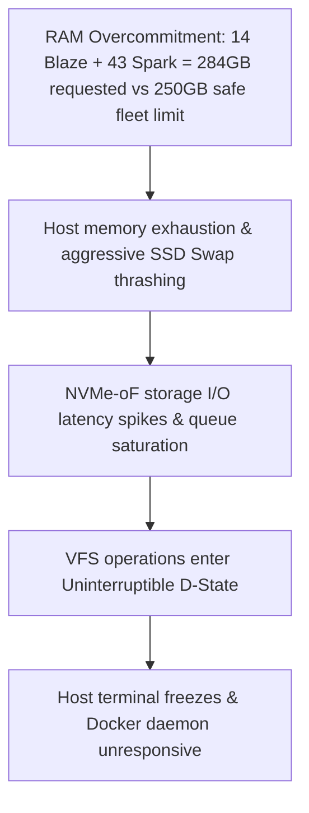

# Fleet Clean-Up, Reset, and VFS/NVMe-oF Troubleshooting Guide

This document provides a comprehensive runbook and architectural breakdown of the fleet-wide cleanup and reset operations conducted on the LaaS platform. It outlines the root causes of the system freeze, database desynchronizations, and kernel-level storage locks, followed by the exact steps required to perform a clean state reset.

---

## 1. Incident Analysis & Root Causes

During high-concurrency loads (e.g., 57 instances), the system experienced a cascading freeze. Here is the technical breakdown of the locking chain:



### Key Technical Learnings:
1. **SSD Swap Thrashing:** When physical memory (60GiB/node) was exhausted, Linux began swapping active memory pages to SSD swap space. Swap I/O saturated the SSD queue, causing ZFS/NVMe-oF storage operations to block.
2. **Circular VFS Locks (Local Mounts):** Running recovery scripts that locally mount user zvols (`/dev/zd*`) inside the `/datapool/users/` path (which is itself a ZFS dataset) on `aiserver1` causes circular VFS dependency locks.
3. **ConfigFS Symlink Behavior:** In configfs, port links under `/sys/kernel/config/nvmet/ports/1/subsystems/` are **symbolic links**, not directories. Running `rmdir` on them fails silently. They must be removed using `rm -f`.
4. **VFS Phantom Mounts:** Doing a lazy unmount (`umount -l`) while a process (like NFS or Docker) holds a block device file open detaches the path from the filesystem tree but keeps the mount active in the kernel. If the mountpoint directory is subsequently deleted, user-space `umount` fails with `no mount point specified`, locking the ZFS dataset.

---

## 2. Complete Step-by-Step Clean-Up Protocol

If the fleet needs a complete database and storage reset, execute the following steps in order.

### Step 2.1: Disconnect Clients (Compute Nodes)
Before touching the storage node (`aiserver1`), release the network locks held by the compute initiators.

On **`aiserver2`**, **`aiserver3`**, **`aiserver4`**, and **`aiserver5`**:
```bash
# Force drop all active remote NVMe-oF disk connections
sudo nvme disconnect-all
```

---

### Step 2.2: Stop Host Containers & Clear Mounts
On **`aiserver1`**:
```bash
# 1. Force stop and remove all LaaS instance containers
docker ps -a -q --filter "name=laas-" | xargs -r docker rm -f

# 2. Stop the NFS server completely to release VFS locks
sudo systemctl stop nfs-kernel-server 2>/dev/null || sudo systemctl stop nfs-server 2>/dev/null
```

---

### Step 2.3: Clean NVMe-oF Ports & Targets
On **`aiserver1`**:
```bash
# 1. Break the configfs symbolic links as root (breaks the port-to-subsystem link)
sudo sh -c 'rm -f /sys/kernel/config/nvmet/ports/1/subsystems/laas-u_*'

# 2. Reset the NVMe-oF persistence configuration file so target definitions don't restore on reboot
if [ -f /etc/laas/nvmet-targets.json ]; then
  echo '{"targets": {}}' | sudo tee /etc/laas/nvmet-targets.json
fi
```

---

### Step 2.4: Clean Host Boot Mounts (`/etc/fstab`)
Ensure user storage volumes are not automatically mounted on host boot.

On **`aiserver1`**:
```bash
# Remove all user zvol mount lines from /etc/fstab
sudo sed -i '/\/dev\/zvol\/datapool\/users\/u_/d' /etc/fstab
```

---

### Step 2.5: Database Reset
Reset session states, resource counters, and allocations in the database.

On **`aiserver1`**:
```bash
# 1. Force end all active fleet sessions in the DB
sudo -u postgres psql -d laas -c "
UPDATE sessions
SET
  status = 'ended',
  ended_at = NOW(),
  updated_at = NOW(),
  termination_reason = 'admin_terminated',
  termination_details = '{\"note\": \"Force terminated via batch admin database cleanup\"}'::jsonb
WHERE status IN ('pending', 'starting', 'running', 'reconnecting');
"

# 2. Release active wallet holds
sudo -u postgres psql -d laas -c "
UPDATE wallet_holds
SET status = 'released', released_at = NOW(), release_reason = 'Admin database clean-up'
WHERE status = 'active';
"

# 3. Clear ALL live resource reservations
sudo -u postgres psql -d laas -c "
DELETE FROM node_resource_reservations;
"

# 4. Reset node resource allocation tracking counters to 0
sudo -u postgres psql -d laas -c "
UPDATE nodes 
SET 
  allocated_vcpu = 0, 
  allocated_memory_mb = 0, 
  allocated_gpu_vram_mb = 0,
  current_session_count = 0;
"

# 5. Clear all storage-provisioning metadata from users (so they can provision fresh volumes)
sudo -u postgres psql -d laas -c "
UPDATE users 
SET 
  storage_uid = NULL, 
  storage_provisioning_status = NULL, 
  storage_provisioned_at = NULL, 
  storage_provisioning_error = NULL;
"

# 6. Delete all User Storage Volume records (after nullifying billing charge foreign keys)
sudo -u postgres psql -d laas -c "
UPDATE billing_charges SET storage_volume_id = NULL WHERE storage_volume_id IS NOT NULL;
DELETE FROM storage_extensions;
UPDATE os_switch_history SET old_volume_id = NULL, new_volume_id = NULL;
DELETE FROM user_storage_volumes;
"
```

---

### Step 2.6: Destroy ZFS Datasets
Reboot `aiserver1` to clear any lingering VFS phantom mounts, then execute the final ZFS dataset deletion:

On **`aiserver1`**:
```bash
# 1. Reboot to clear kernel phantom mounts
sudo reboot

# (After rebooting and logging back in)
# 2. Destroy all user ZFS datasets recursively (reclaims 100% SSD space)
for dataset in $(sudo zfs list -H -o name -r datapool/users | grep "datapool/users/u_"); do
  uid=$(basename "$dataset")
  echo "Destroying ZFS dataset: $uid..."
  sudo zfs destroy -rf datapool/users/$uid
done
```

---

## 3. Preventive Architecture Guidelines

To prevent future lockups and keep the storage node stable, adhere to these guidelines:

1. **Avoid Local Mounts on Storage Node:** Never manually mount user block devices (`/dev/zd*`) locally on the storage node (`aiserver1`) unless performing offline emergency diagnostics.
2. **Review Memory Overcommit Limits:** Restrict the maximum concurrent allocations in the scheduler (or scale down Spark / Blaze RAM configurations) so that total fleet allocations do not exceed **250GB RAM** to prevent Swap thrashing.
3. **Orphan Cleanup Cron:** Ephemeral storage is automatically garbage-collected by the background daemon thread in `session-orchestration` (`cleanup_orphaned_ephemeral_zvols()`). Ensure the orchestrator daemon is healthy and running on all nodes.
